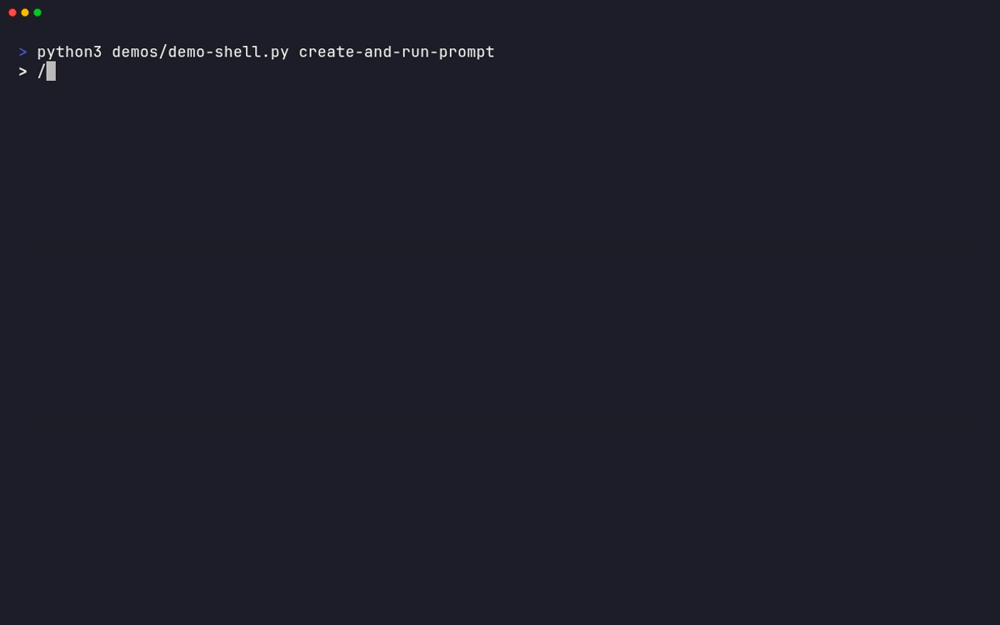
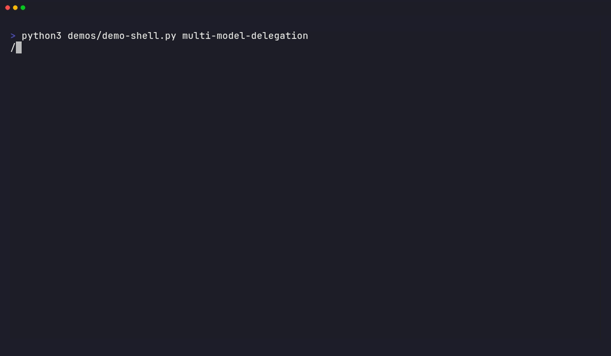
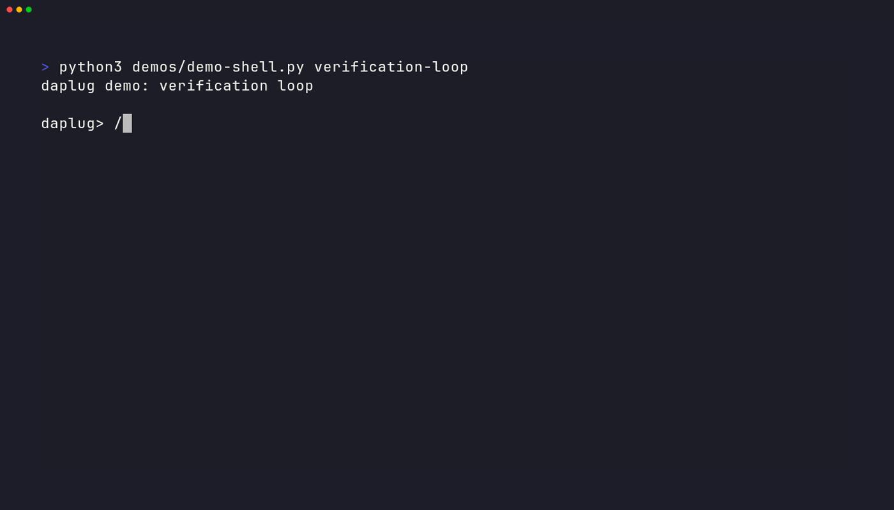
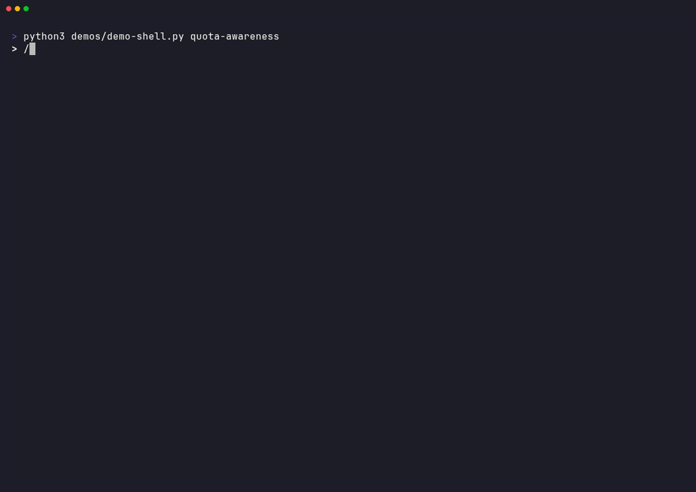
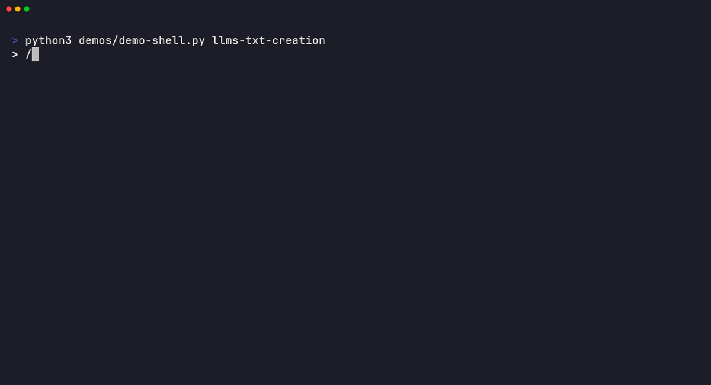

# daplug

Delegate prompts to Codex, Gemini, Z.AI, or local models from Claude Code — with worktree isolation and Ralph-Wiggum-inspired verification loops.

## Installation

### From Marketplace (Recommended)

Run these commands in your terminal (not inside Claude Code):

```bash
# Add the marketplace (SSH)
claude plugin marketplace add cruzanstx/daplug

# Or via HTTPS
claude plugin marketplace add https://github.com/cruzanstx/daplug

# Install daplug
claude plugin install daplug@cruzanstx
```

### Manual Installation

Clone/copy this plugin to one of:
- `~/.claude/plugins/daplug/` (user scope)
- `.claude/plugins/daplug/` (project scope)

## What's Included

### Commands (17)

| Command | Description |
|---------|-------------|
| `/daplug:check-config` | Verify daplug configuration status and detect legacy settings |
| `/daplug:cclimits` | Check AI CLI usage/quota (Claude, Codex, Gemini, Z.AI) |
| `/daplug:check-updates` | Check if plugin has updates available |
| `/daplug:codex-cli` | Run task with OpenAI Codex CLI |
| `/daplug:create-llms-txt` | Research and generate llms_txt documentation |
| `/daplug:create-prompt` | Create optimized, XML-structured prompts |
| `/daplug:devstral-cli` | Run task with local Devstral model via Codex CLI |
| `/daplug:gemini-cli` | Run task with Google Gemini CLI |
| `/daplug:load-agents` | Scan and manage available AI coding agents |
| `/daplug:migrate-config` | Migrate legacy CLAUDE.md settings to <daplug_config> |
| `/daplug:prompts` | Analyze prompts folder and recommend next steps |
| `/daplug:qwen-cli` | Run task with local Qwen model via Codex CLI |
| `/daplug:run-prompt` | Execute prompts with various AI models |
| `/daplug:sprint` | Automated sprint planning from specs or existing prompts |
| `/daplug:uvc` | Update docs and push to version control |
| `/daplug:zai-cli` | Run task with Z.AI GLM-4.7 via Codex CLI |
| `/daplug:opencode-cli` | Run task with Z.AI GLM-4.7 via OpenCode CLI (recommended) |

### Agents (5)

| Agent | Description |
|-------|-------------|
| `frontend-build-optimizer` | Optimize frontend build times (SvelteKit, Next.js, Vite) |
| `go-build-optimizer` | Optimize Go compilation and Docker builds |
| `infra-troubleshooter` | Diagnose infrastructure issues |
| `k8s-cicd-troubleshooter` | Troubleshoot Kubernetes and CI/CD pipelines |
| `readonly-log-watcher` | Monitor prompt execution logs without touching files |

### Skills (8)

| Skill | Description |
|-------|-------------|
| `ai-usage` | Check AI CLI usage/quota (Claude, Codex, Gemini, Z.AI) |
| `config-reader` | Read and manage daplug config from CLAUDE.md (<daplug_config>) |
| `prompt-executor` | Execute prompts with AI models, worktrees, tmux |
| `prompt-finder` | Find and resolve prompts in ./prompts/ directory |
| `prompt-manager` | CRUD operations for prompts with subfolder support |
| `sprint` | Automated sprint planning, dependency graphs, execution plans |
| `tmux-manager` | Manage tmux sessions for background tasks |
| `worktree` | Manage git worktrees for isolated development |

### Hooks
- `example-hook.json` - Example hook (logs before bash commands)

### MCP Servers
- `servers.json` - Placeholder MCP config (disabled by default)

## Showcase

Commands below are shown without the `/daplug:` prefix for readability. In Claude Code, use `/daplug:<command>` if you prefer namespaced commands.

### Create & Execute Prompts


> `/create-prompt` generates XML-structured prompts optimized for each task type, then `/run-prompt` executes them with your chosen model.

### Multi-Model Delegation


> Run prompt batches across Claude, Codex, Gemini, or Z.AI with parallel execution and quota-aware routing.

### Worktree Isolation


> Execute prompts in isolated git worktrees to keep your main branch clean while tasks run.

### Verification Loops


> Re-run prompts until tests pass with `--loop` and completion-marker detection.

### Quota Awareness


> Check usage across all AI CLIs and pick the model with the most headroom.

### LLMS.txt Generation


> `/create-llms-txt` scaffolds research prompts in your llms_txt repo and supports cross-repo execution.

## Quick Examples

### Generate a Feature Prompt
```bash
# In Claude Code:
/create-prompt "add user authentication with JWT"
```

### Run Across Multiple Models
```bash
/run-prompt 005 --model codex        # OpenAI Codex
/run-prompt 005 --model gemini       # Google Gemini 3 Flash
/run-prompt 005 --model opencode     # Z.AI GLM-4.7 (recommended)
/run-prompt 005 --model zai          # Z.AI GLM-4.7 (via Codex)
```

### Parallel Execution
```bash
/run-prompt 001 002 003 --parallel --worktree
```

### Check Quota Before Running
```bash
/cclimits
# Shows: Claude: 18% | Codex: 0% | Gemini: 7% | Z.AI: 1%
```

## Recent Changes

### v0.20.0 (2026-01-18)
- **OpenCode CLI support**: New `opencode` model for Z.AI GLM-4.7 via OpenCode CLI
- **Recommended for Z.AI**: OpenCode handles GLM-4.7 message format correctly (fixes GitHub Issue #4)
- **PTY wrapper**: Automatic pseudo-terminal wrapping for CLIs that require it
- **New tests**: 7 unit tests for model configuration and PTY command wrapping

### v0.19.0 (2026-01-18)
- **Sprint from existing prompts**: New `--from-existing` flag analyzes prompts already in `prompts/` instead of generating from a spec
- **Prompt filtering**: `--prompts 001-005,010`, `--folder providers/`, `--exclude 003,007` for precise selection
- **Dependency detection**: Scans prompt content for `depends on`, `requires`, `@file` references
- **Run script generation**: Produces executable `run-sprint.sh` for batch execution

### v0.18.0 (2026-01-17)
- **Sprint command**: New `/sprint` command for automated sprint planning from technical specifications
- **5-phase workflow**: Spec analysis → prompt generation → dependency graph → model assignment → execution plan
- **State management**: Persistent `.sprint-state.json` for pause/resume/status tracking
- **Sub-commands**: `status`, `add`, `remove`, `replan`, `pause`, `resume`, `cancel`, `history`

### v0.15.0 (2026-01-11)
- **Subfolder support**: Organize prompts into topic-based subfolders (e.g., `prompts/providers/`, `prompts/backend/`)
- **New flags**: `--folder/-f` for create, `--tree` for list, `--folder` for next-number
- **Folder-aware resolution**: `find 011` searches all folders, `find providers/011` targets specific folder
- **Range expansion**: `providers/011-013` expands correctly with folder prefix
- **Auto-create folders**: Folders created automatically on first prompt
- **JSON output**: Now includes `folder`, `path`, `status` fields
- **Branch naming**: Includes folder path to avoid collisions (e.g., `prompt/providers/001-name`)

### v0.14.1 (2026-01-10)
- **Fix**: Corrected marketplace name in `/check-updates` command (`cruzanstx` not `daplug`)

### v0.14.0 (2026-01-10)
- **GPT-5.2 model support**: Added `gpt52`, `gpt52-high`, `gpt52-xhigh` for planning and research tasks
- **Model management utility**: New `scripts/manage-models.py` for listing, checking, and adding models
- **Documentation**: Added "Managing Models" section to CLAUDE.md with checklist and templates

### v0.13.0 (2026-01-05)
- **New config format**: Settings now stored in `<daplug_config>` XML blocks in CLAUDE.md files
- **Migration command**: `/daplug:migrate-config` automatically converts legacy plaintext settings
- **Config detection**: `/daplug:check-config` verifies config status and detects legacy settings
- **New skill: config-reader**: Python-based config parsing with project → user fallback

### v0.12.9 (2026-01-04)
- **Central llms_txt prompts**: `/create-llms-txt` now creates prompts in `$LLMS_TXT_DIR/prompts/` (the llms_txt repo) instead of the current project's `./prompts/`
- **Auto-discovery**: Reads `llms_txt_dir` from `~/.claude/CLAUDE.md`, offers clone/configure flow if not set
- **Cross-repo execution**: Uses `--prompt-file` flag for running prompts from external repos

### v0.12.8 (2026-01-03)
- **New skill: prompt-manager**: Python-based CRUD for prompts (create, list, find, complete, delete)
- **Centralized git root detection**: All prompt operations now use prompt-manager, fixing zsh parsing issues
- `/create-prompt` and `prompt-finder` updated to use prompt-manager

### v0.12.7 (2026-01-03)
- **Zsh compatibility**: Fixed parse error when `$()` command substitution passed through eval in zsh

### v0.12.5 (2026-01-03)
- **Prompts always at git root**: `/create-prompt` now saves to `{git_root}/prompts/` instead of `./prompts/` (relative to cwd)
- **Error handling**: `/run-prompt` now reports errors clearly instead of attempting manual CLI execution
- Models will no longer go off-script when executor fails to find prompts

### v0.12.4 (2026-01-01)
- Made monitor spawning mandatory in Step 2 of `/run-prompt`
- Auto-verify monitor permissions before spawning agents

### v0.12.2 (2025-12-31)
- Added `readonly-log-watcher` agent for lightweight monitoring
- Refactored `/create-llms-txt` to generate prompts for `/run-prompt`

## Customization

1. Edit `.claude-plugin/plugin.json` to change name, version, description, author
2. Add more commands in `commands/`
3. Add agents in `agents/`
4. Add skills in `skills/<skill-name>/SKILL.md`
5. Add hooks in `hooks/`
6. Configure MCP servers in `mcp/servers.json`

### plugin.json Schema

```json
{
  "name": "plugin-name",
  "version": "1.0.0",
  "description": "What the plugin does",
  "author": {
    "name": "Your Name",
    "email": "you@example.com",
    "url": "https://your-site.com"
  },
  "homepage": "https://docs.example.com",
  "repository": "https://github.com/you/plugin",
  "license": "MIT",
  "keywords": ["utility", "helper"]
}
```

| Field | Required | Description |
|-------|----------|-------------|
| `name` | Yes | Unique identifier (kebab-case) |
| `version` | No | Semantic version (e.g., "1.0.0") |
| `description` | No | Brief plugin purpose |
| `author` | No | Object with `name`, `email`, `url` |
| `homepage` | No | Documentation URL |
| `repository` | No | Source code URL |
| `license` | No | License identifier |
| `keywords` | No | Discovery tags array |

**Custom paths** (optional): `commands`, `agents`, `skills`, `hooks`, `mcpServers`, `outputStyles`, `lspServers`

**INVALID fields** (will cause installation to fail): `manifest_version`, `type`, `permissions`, `entry`

## Distribution

### Via Marketplace (Recommended)

This repo is configured as a Claude Code marketplace. Run in terminal:
```bash
# Add marketplace (SSH)
claude plugin marketplace add cruzanstx/daplug

# Or via HTTPS
claude plugin marketplace add https://github.com/cruzanstx/daplug

# Install the plugin
claude plugin install daplug@cruzanstx
```

### Via Git Clone

```bash
git clone cruzanstx/daplug
cp -r daplug ~/.claude/plugins/
```

### Symlink for Development

```bash
ln -s $(pwd) ~/.claude/plugins/daplug
```

### Team Auto-Install

Add to your project's `.claude/settings.json`:
```json
{
  "plugins": {
    "marketplaces": {
      "extraKnown": ["cruzanstx/daplug"]
    }
  },
  "enabledPlugins": ["daplug@cruzanstx"]
}
```

Or install manually for each team member:
```bash
claude plugin marketplace add cruzanstx/daplug
claude plugin install daplug@cruzanstx
```

## Updating

Claude Code doesn't have built-in plugin update notifications yet ([feature request #10265](https://github.com/anthropics/claude-code/issues/10265)). Here are workarounds:

### Manual Update

```bash
# Uninstall, refresh marketplace, then reinstall
claude plugin uninstall daplug@cruzanstx
claude plugin marketplace update cruzanstx
claude plugin install daplug@cruzanstx
```

**Important**: You must uninstall first - `claude plugin install` won't overwrite an existing cached version.

### Option 1: GitLab CI Notification

Add to `.gitlab-ci.yml` to notify your team when the plugin version changes:

```yaml
notify-plugin-update:
  stage: notify
  rules:
    - changes:
        - .claude-plugin/plugin.json
  script:
    - |
      VERSION=$(jq -r '.version' .claude-plugin/plugin.json)
      echo "daplug updated to v${VERSION}"
      # Slack notification (uncomment and configure):
      # curl -X POST -H 'Content-type: application/json' \
      #   --data "{\"text\":\"daplug plugin updated to v${VERSION} - run: claude plugin uninstall daplug@cruzanstx && claude plugin marketplace update cruzanstx && claude plugin install daplug@cruzanstx\"}" \
      #   $SLACK_WEBHOOK_URL

      # Email notification (uncomment and configure):
      # echo "daplug v${VERSION} released" | mail -s "Plugin Update" team@example.com
```

### Option 2: Check Command (Included)

This plugin includes `/daplug:check-updates` which compares your installed version against the marketplace:

```
/daplug:check-updates
```

Output:
```
daplug: v0.3.0 -> v0.3.0
UP_TO_DATE
```

Or when an update is available:
```
daplug: v0.2.0 -> v0.3.0
NEEDS_UPDATE

Update available! Run:
  claude plugin uninstall daplug@cruzanstx && claude plugin marketplace update cruzanstx && claude plugin install daplug@cruzanstx

Then resume session:
  claude --resume
```

Running `--resume` without an ID shows available sessions to pick from.

**Note**: The uninstall is required because `claude plugin install` won't overwrite an existing cached version.

### Option 3: Notification Hook (Limited)

Claude Code hooks can't trigger on startup, but you can create a reminder that fires on specific events. Add `hooks/update-reminder.json`:

```json
{
  "name": "update-reminder",
  "description": "Periodic reminder to check for plugin updates",
  "hooks": [
    {
      "matcher": {
        "type": "event",
        "event": "Notification"
      },
      "hooks": [
        {
          "type": "command",
          "command": "echo 'Tip: Run /daplug:check-updates to check for plugin updates'"
        }
      ]
    }
  ]
}
```

**Note**: This approach is limited since there's no "on startup" or "periodic" hook event. It only triggers when Claude sends a notification.

### Recommended Setup

For teams, combine:
1. **GitLab CI** (Option 1) - Automatic team-wide notifications on release
2. **Check command** (Option 2) - On-demand version checking for individuals

## First-Run Setup

On first use, daplug prompts for user settings and saves them to `~/.claude/CLAUDE.md` under a `<daplug_config>` block:

```markdown
<daplug_config>
preferred_agent: codex
worktree_dir: .worktrees/
llms_txt_dir: /storage/projects/docker/llms_txt
ai_usage_awareness: enabled
cli_logs_dir: ~/.claude/cli-logs/
</daplug_config>
```

| Setting | When Prompted | Default |
|---------|---------------|---------|
| `preferred_agent` | Running `/daplug:prompts` | Asks user to choose |
| `worktree_dir` | Running `/daplug:run-prompt --worktree` | `../worktrees` |
| `llms_txt_dir` | Running `/daplug:create-llms-txt` | `../llms_txt` |
| `ai_usage_awareness` | Running `/daplug:create-prompt` (when choosing executor) | Asks user (enabled/disabled) |
| `cli_logs_dir` | Not prompted (advanced) | `~/.claude/cli-logs/` |

Settings are checked in order: project `./CLAUDE.md` → user `~/.claude/CLAUDE.md`

If you still have legacy plaintext settings, run `/daplug:migrate-config` to upgrade them.

### AI Usage Awareness

Daplug integrates with [cclimits](https://github.com/cruzanstx/cclimits) ([npm](https://www.npmjs.com/package/cclimits)) to provide real-time quota monitoring across all AI CLI tools.

**What is cclimits?**

A standalone CLI tool that checks quota/usage for AI coding tools:
- **Claude Code** - 5-hour and 7-day rolling windows
- **OpenAI Codex** - Primary and secondary rate limits
- **Google Gemini CLI** - Per-model quotas (3-Flash, Flash, Pro tiers)
- **Z.AI** - Token quota percentage
- **OpenRouter** - Account balance

**Integration with daplug:**

When `ai_usage_awareness` is enabled, `/create-prompt` will:
- Run `npx cclimits --json` before presenting model options
- Show quota percentages for each AI model
- Warn about models near their limits (>70% ⚠️, >90% 🔴)
- Suggest fallback models when preferred agent is unavailable
- Show individual Gemini model quotas

You can also check usage directly:
```bash
# Via daplug command
/daplug:cclimits

# Or directly via npx
npx cclimits              # Detailed output
npx cclimits --oneline    # Compact one-liner
npx cclimits --json       # JSON for scripting
```

**Example output:**
```
Claude: 4.0% (5h) ✅ | Codex: 0% (5h) ✅ | Z.AI: 1% ✅ | Gemini: ( 3-Flash 7% ✅ | Flash 1% ✅ | Pro 10% ✅ )
```

**Status icons:**
| Icon | Meaning |
|------|---------|
| ✅ | Under 70% - plenty of capacity |
| ⚠️ | 70-90% - moderate usage |
| 🔴 | 90-100% - near limit |
| ❌ | 100% or unavailable |

**Toggle setting:**

Update `~/.claude/CLAUDE.md` under `<daplug_config>`:
```markdown
<daplug_config>
ai_usage_awareness: enabled   # or 'disabled'
</daplug_config>
```

**Learn more:** [cclimits on GitHub](https://github.com/cruzanstx/cclimits) | [cclimits on npm](https://www.npmjs.com/package/cclimits)

### Codex CLI Prerequisites

Commands that use Codex CLI (`codex-cli`, `qwen-cli`, `zai-cli`) check for required config on first run:

**For qwen-cli (LMStudio):**
```toml
# ~/.codex/config.toml
[model_providers.lmstudio-remote]
name = "LMStudio"
base_url = "http://YOUR_IP:1234/v1"
env_key = "LMSTUDIO_API_KEY"
wire_api = "chat"

[profiles.local]
model_provider = "lmstudio-remote"
model = "qwen/qwen3-next-80b"

[env]
LMSTUDIO_API_KEY = "lm-studio"
```

**For zai-cli (Z.AI):**
```toml
# ~/.codex/config.toml
[model_providers.zai]
name = "Z.AI"
base_url = "https://api.z.ai/api/coding/paas/v4"
env_key = "ZAI_KEY"
wire_api = "chat"

[profiles.zai]
model_provider = "zai"
model = "glm-4.7"

[env]
ZAI_KEY = "your-api-key"  # Get from https://z.ai/manage-apikey
```

If config is missing, the commands will prompt you to set it up.

## Known Limitations

### Plugin Path References

Commands that reference internal plugin files (like `run-prompt.md` calling `executor.py`) should read the install path from Claude's manifest:

```bash
# Get exact install path from Claude's tracking
PLUGIN_ROOT=$(jq -r '.plugins."daplug@cruzanstx"[0].installPath' ~/.claude/plugins/installed_plugins.json)
EXECUTOR="$PLUGIN_ROOT/skills/prompt-executor/scripts/executor.py"
python3 "$EXECUTOR" 123 --model codex
```

**Why read from `installed_plugins.json`?**

The cache directory may contain multiple plugin versions (0.1.0, 0.2.0, 0.3.0, etc.) after upgrades. Glob patterns would expand to ALL versions:
```bash
# BAD - expands to multiple paths
echo ~/.claude/plugins/cache/.../*/...executor.py
# Result: "/path/0.1.0/.../executor.py /path/0.2.0/.../executor.py ..."
```

Reading from `installed_plugins.json`:
- Uses Claude's own tracking of the active install path
- No glob expansion issues
- Single source of truth

**Why not use `${CLAUDE_PLUGIN_ROOT}`?**

Claude Code provides a `${CLAUDE_PLUGIN_ROOT}` variable, but there's a [known bug (#9354)](https://github.com/anthropics/claude-code/issues/9354) where it doesn't work in command markdown files.

**Where `${CLAUDE_PLUGIN_ROOT}` works:** Hooks JSON, MCP configs, LSP configs

**Where it doesn't work:** Command `.md` files

### Prompt Execution

The executor uses stdin for codex models to avoid shell escaping issues with complex prompts:

```python
# Codex: uses stdin with '-' flag
codex exec --full-auto -  # reads from stdin

# Gemini: uses -p flag for headless mode
gemini -y -p "prompt content"
```

This prevents issues with prompts containing newlines, quotes, backticks, and XML tags.

### Gemini CLI Model Tiers

Gemini models share quotas in tiers (observed with Google One Premium):

| Tier | Models | Shorthand |
|------|--------|-----------|
| **Pro** | gemini-2.5-pro, gemini-3-pro-preview | `gemini-high`, `gemini-xhigh` |
| **Flash** | gemini-2.5-flash, gemini-2.5-flash-lite | `gemini25flash`, `gemini25lite` |
| **3 Flash** | gemini-3-flash-preview | `gemini` (default) |

**Why `gemini` defaults to 3 Flash:**
- Best coding performance (78% SWE-bench score)
- Has its own separate quota bucket
- Won't eat into Pro limits for complex tasks

**Check usage:** Run `gemini` interactively and type `/usage`.

**Model shortcuts:**
| Shorthand | Model | Use Case |
|-----------|-------|----------|
| `gemini` | 3 Flash | Fast, daily driver (default) |
| `gemini-high` | 2.5 Pro | Stable, more capable |
| `gemini-xhigh` | 3 Pro | Most capable, complex tasks |

### OpenAI Model Tiers

| Shorthand | Model | Best For |
|-----------|-------|----------|
| `codex` | gpt-5.2-codex | Fast coding execution |
| `codex-high` | gpt-5.2-codex (high) | Complex coding |
| `codex-xhigh` | gpt-5.2-codex (xhigh) | Large refactors |
| `gpt52` | gpt-5.2 | Planning, research, analysis |
| `gpt52-high` | gpt-5.2 (high) | Deep reasoning |
| `gpt52-xhigh` | gpt-5.2 (xhigh) | Maximum reasoning (30+ min) |

**When to use GPT-5.2 vs GPT-5.2-Codex:**
- **GPT-5.2-Codex**: Best when plans are clear, need fast execution
- **GPT-5.2**: Best for ambiguous problems, research, methodical analysis

## Worktree Auto-Install

When using `--worktree`, the executor automatically detects and installs project dependencies after creating the worktree. This ensures verification commands (build, test, lint) work correctly in the isolated environment.

### Supported Package Managers

| Type | Lock File | Install Command | Search Dirs |
|------|-----------|-----------------|-------------|
| npm | `package-lock.json` | `npm ci` | `.`, `frontend`, `web`, `client`, `app` |
| pnpm | `pnpm-lock.yaml` | `pnpm install --frozen-lockfile` | same |
| yarn | `yarn.lock` | `yarn install --frozen-lockfile` | same |
| Go | `go.mod` | `go mod download` | `.` |
| pip | `requirements.txt` | `pip install -r requirements.txt` | `.` |
| poetry | `poetry.lock` | `poetry install` | `.` |
| uv | `uv.lock` | `uv sync` | `.` |

### Behavior

- Runs automatically after worktree creation (no flag needed)
- Logs progress to stderr: `[Worktree] Detected: frontend/package-lock.json (npm)`
- Install failures are logged but don't block prompt execution
- Results included in JSON output under `dependencies_installed`

### Example Output

```
[Worktree] Installing dependencies...
[Worktree]   Detected: frontend/package-lock.json (npm)
[Worktree]   Running: npm ci
[Worktree]   npm ci completed (23.4s)
[Worktree] Dependencies installed successfully
```

---

## Verification Loop

The `--loop` flag enables iterative execution where prompts re-run until they report completion. Useful for test/build tasks that may need multiple attempts.

### Inspiration

This feature is inspired by the [ralph-wiggum](https://github.com/anthropics/claude-plugins-official/tree/main/plugins/ralph-wiggum) plugin from Anthropic's official plugin collection. Ralph-wiggum implements a "self-referential feedback loop" that re-runs Claude until a completion promise is found.

**Compare & Contrast:**

| Aspect | ralph-wiggum | daplug `--loop` |
|--------|--------------|-----------------|
| **Mechanism** | [Stop hooks](https://github.com/anthropics/claude-plugins-official/blob/main/plugins/ralph-wiggum/hooks/hooks.json) intercept Claude's exit | Python loop in executor.py |
| **Loop control** | Hook script feeds prompt back to Claude | Executor re-runs CLI directly |
| **State file** | `.claude/ralph-loop.local.md` | `~/.claude/loop-state/{num}.json` |
| **Completion marker** | `<promise>COMPLETE</promise>` | `<verification>VERIFICATION_COMPLETE</verification>` |
| **Works with** | Claude Code only | Any CLI (codex, gemini, zai, etc.) |
| **Runs in** | Interactive Claude session | Background process |

**Why no hooks?** Ralph-wiggum's hook approach only works within Claude Code sessions. Our implementation needs to support external CLIs (Codex, Gemini, Z.AI) that don't have Claude's hook system. The Python-based loop runs the CLI, waits for completion, checks logs for markers, and re-runs if needed - all without requiring hooks.

### Usage

```bash
/daplug:run-prompt 123 --model codex --loop
/daplug:run-prompt 123 --model codex --loop --max-iterations 5
```

### Completion Markers

The executor wraps your prompt with verification protocol instructions. The agent signals completion by outputting:

```xml
<!-- Success - task complete -->
<verification>VERIFICATION_COMPLETE</verification>

<!-- Retry needed - explain why -->
<verification>NEEDS_RETRY: Tests failing - 3 auth tests need fixing</verification>
```

### How It Works

1. Your prompt is wrapped with verification instructions
2. Agent runs and outputs a completion marker
3. If `VERIFICATION_COMPLETE` found → loop ends successfully
4. If `NEEDS_RETRY` found or no marker → loop continues
5. Retry reasons are passed into the next iteration as feedback
6. Each iteration sees previous work (files, git history)
7. Loop ends at max iterations (default: 3)

### Loop State

State is persisted in `~/.claude/loop-state/{prompt-number}.json`:

```json
{
  "prompt_number": "123",
  "iteration": 3,
  "max_iterations": 3,
  "status": "running",
  "last_updated_at": "2025-12-29T18:30:00",
  "history": [
    {"iteration": 1, "exit_code": 0, "marker_found": false, "retry_reason": "Tests failing"},
    {"iteration": 2, "exit_code": 1, "marker_found": false, "retry_reason": "Lint errors remain"}
  ],
  "suggested_next_steps": [
    {"text": "Deploy to staging", "original": "1) Deploy to staging", "source_iteration": 1}
  ]
}
```

Check status: `python3 "$EXECUTOR" 123 --loop-status`

The executor also extracts "Next steps" / "TODO" suggestions from logs and returns them in the loop result JSON so follow-up prompts can be created automatically.

### Writing Verification-Aware Prompts

For best results with `--loop`:

1. **Include explicit verification steps** - List what must pass (tests, build, lint)
2. **Make verification checkable** - Use commands that return clear pass/fail
3. **Be specific about "done"** - Avoid ambiguous completion criteria

Example prompt structure:
```markdown
## Requirements
- Add login/logout endpoints
- Password hashing with bcrypt

## Verification Criteria
- [ ] All tests pass: `npm test`
- [ ] Build succeeds: `npm run build`
- [ ] No lint errors: `npm run lint`

When ALL criteria verified, output:
<verification>VERIFICATION_COMPLETE</verification>
```
