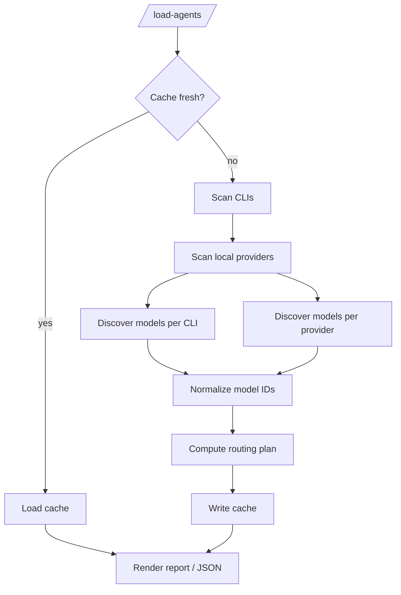

# Agent/Model Detection (daplug) — Extensible Design

## 1) Executive Summary

daplug currently routes prompts to a small, hardcoded set of “runners” (Claude Code, Codex CLI, Gemini CLI, OpenCode). The ecosystem is expanding quickly, and most coding CLIs can now execute models from multiple providers (OpenAI, Anthropic, Google, Z.AI, and local OpenAI-compatible servers).

This document designs an **extensible, plugin-based detection system** that:

- Automatically discovers which AI coding CLIs are installed and usable.
- Detects local model servers (Ollama, LM Studio, vLLM, llama.cpp) and queries their loaded/available models.
- Normalizes “available models” into a single inventory and produces a **routing plan** (preferred runner + fallbacks per model family).
- Caches results to a versioned JSON file so `/load-agents` is fast and works offline.
- Makes adding a new CLI/plugin require **<50 lines** in the common case.

Key design choice: treat **CLI runners** (Codex, OpenCode, Aider, etc.) and **local model providers** (LM Studio, Ollama, vLLM, llama.cpp) as two plugin families. CLIs can depend on providers (e.g., Codex “local” profile points at LM Studio), and the final routing matrix is computed from both sets.

## 2) CLI Research Matrix (Detection + Models + Invocation)

### 2.1 Summary table

| CLI | Detect installed | Config locations (typical) | Config format | Model discovery strategy | Cross-provider? | Invocation for daplug |
|---|---|---|---|---|---|---|
| **Claude Code** (`claude`) | `command -v claude` | `~/.claude/settings.json`, `.claude/settings.json`, `.claude/settings.local.json` | JSON | Static “known Claude Code models” + (optional) `ANTHROPIC_MODEL`/settings | No (Anthropic only) | `claude -p "<prompt>"` |
| **OpenAI Codex CLI** (`codex`) | `command -v codex` | `~/.codex/config.toml` | TOML | Parse config for default model + profiles; optionally hit provider `/v1/models` for OpenAI-compatible providers | Yes (custom providers) | `codex exec --full-auto ... "<prompt>"` |
| **Google Gemini CLI** (`gemini`) | `command -v gemini` | `~/.gemini/settings.json`, `.gemini/settings.json` | JSON | Static/known Gemini model set + user preference; optionally parse settings | No (Google only) | `gemini -m <model> -p "<prompt>"` |
| **OpenCode** (`opencode`) | `command -v opencode` | `~/.config/opencode/opencode.json`, `./opencode.json` | JSON/JSONC | `opencode models` and config parse | Yes | `opencode run --format json -m <provider/model> "<prompt>"` |
| **Goose** (`goose`) | `command -v goose` | `~/.config/goose/config.yaml` (+ related files) | YAML | Parse config (provider/model); optional “provider-known defaults” | Yes | `goose run --text "<prompt>"` |
| **Aider** (`aider`) | `command -v aider` | `./.aider.conf.yml`, `~/.aider.conf.yml` | YAML | `aider --list-models <filter>` + config parse | Yes | `aider --model <model> --message "<prompt>"` |
| **GitHub Copilot CLI** (`copilot`) | `command -v copilot` | `~/.copilot/config.json` | JSON | CLI help/known set; optional config parse | Yes (routes via Copilot) | `copilot -p "<prompt>"` |
| **gh-copilot extension** (`gh copilot`) | `gh extension list` contains `github/gh-copilot` | via GH config; no stable dedicated file | mixed | Treat as “capabilities only” (deprecated/archived) | Yes | `gh copilot suggest ...` / `gh copilot explain ...` |

> Notes
> - “Model discovery strategy” is intentionally layered: **prefer a CLI-native “list models” command** when available (OpenCode, Aider), otherwise **parse config**, otherwise fall back to a **known model family list** (Claude Code, Gemini).
> - Config locations can vary by OS and by `XDG_*` env vars; each plugin should implement a list of candidate paths.

### 2.2 Tier 1 CLIs (Must Have)

#### Claude Code (Anthropic)

- Install detection: executable `claude` in `PATH`.
- Config:
  - User: `~/.claude/settings.json`
  - Project: `.claude/settings.json`
  - Project-local overrides (gitignored): `.claude/settings.local.json`
  - Docs: https://docs.anthropic.com/en/docs/claude-code/settings
- Models: Claude Code supports multiple Claude models and allows selection via `--model`, `ANTHROPIC_MODEL`, and the interactive `/model` command. Expose discovered/known models as `anthropic:<model-id>` inventory items and route them to `claude-code` by default.
  - Docs: https://support.anthropic.com/en/articles/11145967-claude-code-model-configuration and https://support.anthropic.com/en/articles/11009933-what-models-are-available-in-claude-code
- Invocation:
  - Non-interactive prompt: `claude -p "…"`.
  - Docs: https://code.claude.com/docs/reference/headless and https://code.claude.com/docs/reference/cli
- Cross-provider support: **No** (Claude only).
- Auth:
  - User signs in via Claude Code login flow; daplug should treat missing auth as an issue (“Claude Code not logged in”) if `claude -p` fails.

#### OpenAI Codex CLI

- Install detection: executable `codex` in `PATH` (`npm i -g @openai/codex`).
- Config:
  - User: `~/.codex/config.toml`
  - Docs: https://developers.openai.com/codex/config and https://developers.openai.com/codex/config-advanced
- Models:
  - “Native” OpenAI models supported by Codex CLI are documented; expose as `openai:<model-id>` defaults.
  - Docs: https://developers.openai.com/codex/models
  - Custom providers:
    - Codex supports additional `model_providers` and `profiles` (used today in daplug for Z.AI and local LM Studio).
- Invocation:
  - `codex exec --full-auto -m <model> "<prompt>"`
  - Profiles: `codex exec --full-auto --profile <name> "<prompt>"`
- Cross-provider support: **Yes** (via custom providers / OpenAI-compatible endpoints).
- Auth:
  - Either user account login or API key flow; treat missing credentials as an issue if codex commands fail.

#### Google Gemini CLI

- Install detection: executable `gemini` in `PATH` (`npm i -g @google/gemini-cli`).
- Config:
  - User: `~/.gemini/settings.json`
  - Project: `.gemini/settings.json`
  - Docs: https://geminicli.com/docs/get-started/configuration
- Models:
  - Gemini CLI supports both “auto” selection and explicit models. Common explicit models include:
    - `gemini-2.5-pro`, `gemini-2.5-flash`, `gemini-2.5-flash-lite`
    - preview models like `gemini-3-pro-preview`, `gemini-3-flash-preview` (subject to change)
  - Docs: https://geminicli.com/docs/cli/model-configuration
- Invocation:
  - `gemini -m <model> -p "<prompt>"`
- Cross-provider support: **No** (Gemini only).
- Auth:
  - Gemini CLI typically uses a Google login flow; treat “not authenticated” as an issue if non-interactive invocation fails.

#### OpenCode (Z.AI + multi-provider)

- Install detection: executable `opencode` in `PATH`.
- Config:
  - Global: `~/.config/opencode/opencode.json`
  - Project: `./opencode.json`
  - Docs: https://opencode.ai/docs/configuration/config-file
- Models:
  - CLI supports listing models: `opencode models` (optionally per provider).
  - Docs: https://opencode.ai/docs/configuration/models
- Auth:
  - `opencode auth login` stores credentials at `~/.local/share/opencode/auth.json`
  - Docs: https://opencode.ai/docs/configuration/authentication
- Invocation:
  - `opencode run --format json -m <provider/model> "<prompt>"`
- Cross-provider support: **Yes** (OpenAI, Anthropic, Google, Z.AI, local OpenAI-compatible servers, etc.).

### 2.3 Tier 2 CLIs (Should Have)

#### Goose (Block)

- Install detection: executable `goose` in `PATH`.
- Config:
  - Main config: `~/.config/goose/config.yaml`
  - Related files: `~/.config/goose/secrets.yaml`, `~/.config/goose/permission.yaml`, `~/.config/goose/profiles.yaml`
  - Docs: https://block.github.io/goose/docs/getting-started/configuration
- Providers/models:
  - Goose supports multiple providers; the effective provider/model is driven by config + env vars.
  - Providers: https://block.github.io/goose/docs/getting-started/providers
- Invocation:
  - `goose run --text "<prompt>"`
  - Docs: https://block.github.io/goose/docs/guides/goose-cli

#### Aider

- Install detection: executable `aider` in `PATH` (`pipx install aider-chat` or `pip install aider-chat`).
- Config:
  - Project: `./.aider.conf.yml`
  - User: `~/.aider.conf.yml`
  - Docs: https://aider.chat/docs/config.html
- Models:
  - CLI supports listing models: `aider --list-models <filter>`
  - Docs: https://aider.chat/docs/usage.html#listing-available-models
- Invocation:
  - Non-interactive message: `aider --message "<prompt>"` (and optionally `--model <model>`)
  - Docs: https://aider.chat/docs/usage.html#non-interactive-mode

#### GitHub Copilot (CLI)

There are two “Copilot CLI” shapes in the ecosystem:

1) **Copilot CLI** (`copilot`, first-party GitHub) with its own config file:
- Config: `~/.copilot/config.json`
- Docs: https://docs.github.com/en/copilot/how-tos/use-copilot-on-the-command-line/configure-the-github-copilot-cli
- Invocation:
  - Prompt mode: `copilot -p "<prompt>"`
  - Docs: https://docs.github.com/en/copilot/how-tos/use-copilot-on-the-command-line/use-the-github-copilot-cli

2) **`gh` extension** (`gh copilot`, legacy):
- Repo: https://github.com/github/gh-copilot (archived)
- Detect via: `gh extension list` output contains `github/gh-copilot`

For daplug’s detection system, treat `copilot` as the preferred Copilot CLI if both are present.

## 3) Local Model Providers (Detect + Query Models)

Local models are typically served by a provider and then consumed by a CLI runner. daplug should detect **provider servers** independently, then map which CLIs can connect.

| Provider | Default endpoint | Health check | Model list | Notes |
|---|---|---|---|---|
| **Ollama** | `http://localhost:11434` | `GET /api/version` | `GET /api/tags` | Native REST API (non-OpenAI); docs: https://github.com/ollama/ollama/blob/main/docs/api.md |
| **LM Studio** | `http://localhost:1234` | `GET /v1/models` | `GET /v1/models` | OpenAI-compatible; docs: https://lmstudio.ai/docs/app/api/overview |
| **vLLM** | `http://localhost:8000` | `GET /v1/models` | `GET /v1/models` | OpenAI-compatible; docs: https://docs.vllm.ai/en/latest/serving/openai_compatible_server.html |
| **llama.cpp** (`llama-server`) | `http://localhost:8080` | `GET /v1/models` (or `/health` when available) | `GET /v1/models` | OpenAI-compatible; example docs: https://github.com/ggml-org/llama.cpp/tree/master/examples/server |

Compatibility mapping (initial):
- OpenAI-compatible servers (LM Studio, vLLM, llama.cpp) can usually be used by **Codex**, **OpenCode**, and **Aider** (via “OpenAI base URL” / provider config).
- Ollama can be used by **OpenCode** (native integration) and sometimes by other CLIs via OpenAI-compat adapters; treat as “native Ollama” first.

## 4) Plugin Architecture (Extensible)

### 4.1 File layout (proposed)

```
skills/agent-detector/
├── SKILL.md
├── scripts/
│   ├── detector.py                 # Orchestrator (scan + route + cache)
│   ├── schema.py                   # Dataclasses + schema validation
│   ├── plugins/
│   │   ├── __init__.py
│   │   ├── base.py                 # CLIPlugin base class
│   │   ├── claude_code.py
│   │   ├── codex.py
│   │   ├── gemini_cli.py
│   │   ├── opencode.py
│   │   ├── goose.py
│   │   ├── aider.py
│   │   ├── copilot_cli.py
│   │   └── gh_copilot.py
│   └── providers/
│       ├── __init__.py
│       ├── base.py                 # ProviderPlugin base class
│       ├── ollama.py
│       ├── lmstudio.py
│       ├── vllm.py
│       └── llama_cpp.py
└── tests/
    └── test_detector_smoke.py       # Pure unit tests (no network)
```

### 4.2 Core data model (normalized inventory)

**Key design goal:** unify model IDs across CLIs/providers so routing and preference storage is stable.

Recommended normalization:

- Provider namespace prefixes:
  - `anthropic:claude-…`
  - `openai:gpt-…`
  - `google:gemini-…`
  - `zai:glm-…`
  - `local:<provider>:<model-id>` (e.g., `local:lmstudio:qwen-2.5-coder-32b`)

Data types (conceptual):

```python
@dataclass(frozen=True)
class ModelInfo:
    id: str               # normalized id (e.g., "openai:gpt-5.2-codex")
    display: str          # human readable
    provider: str         # "openai" | "anthropic" | "google" | "zai" | "local"
    family: str           # routing family key (e.g., "claude", "gpt", "gemini", "glm", "local")
    raw_id: str | None    # CLI-native model id (e.g., "gpt-5.2-codex" or "zai/glm-4.7")
    context_window: int | None = None
```

```python
@dataclass(frozen=True)
class ConfigIssue:
    type: str             # "missing_auth" | "missing_config" | "permissions" | ...
    severity: str         # "info" | "warning" | "error"
    message: str
    fix_available: bool
    fix_id: str | None = None
    docs_url: str | None = None
```

### 4.3 Plugin interfaces

CLI plugin contract (minimal):

```python
class CLIPlugin(ABC):
    name: str                      # stable key, e.g. "codex"
    display_name: str              # e.g. "OpenAI Codex CLI"

    def detect_installation(self) -> bool: ...
    def get_version(self) -> str | None: ...
    def get_executable(self) -> str | None: ...

    def get_config_paths(self) -> list[Path]: ...
    def parse_config(self) -> dict: ...

    def get_available_models(self) -> list[ModelInfo]: ...
    def get_supported_providers(self) -> list[str]: ...

    def detect_issues(self) -> list[ConfigIssue]: ...
    def apply_fix(self, issue: ConfigIssue) -> bool: ...

    def build_command(self, *, model: ModelInfo, prompt: str) -> list[str]: ...
```

Provider plugin contract (minimal):

```python
class ProviderPlugin(ABC):
    name: str                      # "lmstudio"
    display_name: str              # "LM Studio"
    default_endpoint: str

    def detect_running(self) -> tuple[bool, str | None]: ...
    def list_models(self, endpoint: str) -> list[str]: ...
    def compatible_clis(self) -> list[str]: ...
```

### 4.4 Plugin discovery (no central registry)

The orchestrator should automatically import every module in:
- `skills/agent-detector/scripts/plugins/`
- `skills/agent-detector/scripts/providers/`

Each module exports `PLUGIN` (an instance) or a `get_plugin()` function.

This keeps “add a new CLI” to:
- create `plugins/<name>.py`
- implement a small subclass (often just constants + paths + command builder)

### 4.5 “Add a new CLI in <50 lines” template

Example: a simple wrapper for a hypothetical `acme-ai` CLI that only needs PATH detection + `--version` + `-m/-p` flags:

```python
# plugins/acme_ai.py  (≈35 lines)
from __future__ import annotations

from dataclasses import dataclass
from pathlib import Path

from .base import SimpleCLIPlugin, ModelInfo

@dataclass
class AcmeAI(SimpleCLIPlugin):
    name = "acme-ai"
    display_name = "Acme AI CLI"
    executable_names = ("acme-ai",)
    config_paths = (Path("~/.config/acme-ai/config.json").expanduser(),)
    supported_providers = ("openai",)

    def get_available_models(self) -> list[ModelInfo]:
        return [
            ModelInfo(id="openai:gpt-5.2", display="GPT-5.2", provider="openai", family="gpt", raw_id="gpt-5.2"),
        ]

    def build_command(self, *, model: ModelInfo, prompt: str) -> list[str]:
        return [self.executable, "-m", model.raw_id or model.id, "-p", prompt]

PLUGIN = AcmeAI()
```

The base class `SimpleCLIPlugin` supplies:
- `detect_installation()` via `shutil.which`
- `get_version()` via running `--version` with timeouts
- `parse_config()` as “best-effort JSON/YAML/TOML read” (optional)

## 5) Model Routing Table (Preferred runner + fallbacks)

### 5.1 Routing principles

1) Prefer the **native CLI** for its own provider (least friction, best UX).
2) Prefer **multi-provider CLIs** (OpenCode, Codex, Aider) as fallbacks.
3) For **local models**, prefer the CLI that is already configured to talk to the detected local provider.
4) Always allow **user overrides** (per-model and global default runner).

### 5.2 Initial routing matrix (family-level)

| Model family / namespace | Preferred CLI | Fallbacks | Notes |
|---|---|---|---|
| `anthropic:claude-*` | `claude-code` | `opencode`, `aider` | Prefer Claude Code’s first-party account experience |
| `openai:gpt-*` | `codex` | `opencode`, `aider` | Prefer Codex for coding workflows |
| `google:gemini-*` | `gemini` | `opencode`, `aider` | Prefer Gemini CLI for quota/UX |
| `zai:glm-*` | `opencode` | `codex` (profile `zai`) | Prefer OpenCode unless Codex has known-good Z.AI profile |
| `local:*` | `codex` | `opencode`, `aider` | Prefer Codex profiles that map to detected endpoints |
| `copilot:*` | `copilot` | `gh copilot` | Prefer first-party `copilot` binary when present |

### 5.3 Per-model routing entries (computed)

At scan time, convert the family-level table into per-model entries using the discovered inventory:

- For each discovered `ModelInfo`:
  - Determine `preferred` runner from routing matrix.
  - Filter fallbacks to runners that are installed and have access to that provider/endpoint.
  - If no runner matches, mark model as “unroutable” with an issue.

### 5.4 Example routing table (per-model)

This is what daplug should be able to render once inventories are discovered and normalized:

| Model (normalized) | Preferred CLI | Alt CLI 1 | Alt CLI 2 | Notes |
|---|---|---|---|---|
| `anthropic:claude-opus-4-1-20250805` | `claude-code` | `opencode` | `aider` | Prefer Claude Code account UX |
| `anthropic:claude-sonnet-4-5-20250929` | `claude-code` | `opencode` | `aider` | Example “newer” Sonnet ID; list is dynamic |
| `openai:gpt-5.2-codex` | `codex` | `opencode` | `aider` | Codex-native |
| `openai:gpt-5.2` | `codex` | `opencode` | `aider` | General OpenAI |
| `google:gemini-2.5-pro` | `gemini` | `opencode` | `aider` | Gemini-native |
| `zai:glm-4.7` | `opencode` | `codex` | - | Prefer OpenCode unless Codex profile is known-good |
| `local:lmstudio:qwen-2.5-coder-32b` | `codex` | `opencode` | `aider` | Route to the runner already configured to the endpoint |
| `copilot:default` | `copilot` | `gh copilot` | - | Optional runner (user’s preference) |

## 6) Detection Algorithm (Scan + Cache + Route)

### 6.1 Flowchart (high level)



### 6.2 Scan details (recommended implementation)

1) **CLI install discovery**
   - For each `CLIPlugin`:
     - `which`/`shutil.which` for executable names
     - run `--version` (or `version`) with a strict timeout
     - check candidate config paths (do not read unless needed)

2) **Local provider discovery**
   - For each `ProviderPlugin`:
     - attempt `GET` to health endpoint with 250–500ms timeout
     - if up, list models with a second call (timeout 1–2s)

3) **Model discovery**
   - Prefer native list commands:
     - OpenCode: `opencode models`
     - Aider: `aider --list-models <filter>` (use `*`/`all`/empty policy)
   - Otherwise parse config:
     - Codex: `~/.codex/config.toml` default `model` + `profiles.*.model`
     - Goose: `~/.config/goose/config.yaml` provider/model settings
     - Copilot: `~/.copilot/config.json` (where available)
   - Otherwise provide known model sets:
     - Claude Code / Gemini CLI

4) **Routing computation**
   - Use routing matrix + installed runners + detected providers to compute:
     - `routing[model_id].preferred`
     - `routing[model_id].fallbacks[]`

5) **Issue detection**
   - Examples:
     - CLI installed but “not authenticated” (invocation fails quickly)
     - Config present but invalid (parse error)
     - Local provider running but returns empty models
     - Required permissions not present in Claude Code sandbox to read/write needed files

## 7) Cache Schema (Versioned, Extensible)

### 7.1 Cache location

Default cache path:

- `~/.claude/daplug-agents.json`

Rationale: daplug already uses `~/.claude/` for logs and user configuration, and Claude Code permissions can be scoped to this directory.

### 7.2 JSON Schema (Draft 2020-12)

```json
{
  "$schema": "https://json-schema.org/draft/2020-12/schema",
  "$id": "daplug://schemas/agent-detection-cache/1.0",
  "title": "daplug agent detection cache",
  "type": "object",
  "required": ["schema_version", "last_scanned", "clis", "providers", "routing", "user_preferences"],
  "properties": {
    "schema_version": { "type": "string", "enum": ["1.0"] },
    "last_scanned": { "type": "string", "format": "date-time" },
    "scan_duration_ms": { "type": "integer", "minimum": 0 },
    "host": {
      "type": "object",
      "properties": {
        "os": { "type": "string" },
        "arch": { "type": "string" }
      },
      "additionalProperties": true
    },
    "clis": {
      "type": "object",
      "additionalProperties": { "$ref": "#/$defs/cliStatus" }
    },
    "providers": {
      "type": "object",
      "additionalProperties": { "$ref": "#/$defs/providerStatus" }
    },
    "routing": {
      "type": "object",
      "additionalProperties": { "$ref": "#/$defs/routeEntry" }
    },
    "user_preferences": { "$ref": "#/$defs/userPreferences" }
  },
  "$defs": {
    "modelInfo": {
      "type": "object",
      "required": ["id", "display", "provider", "family"],
      "properties": {
        "id": { "type": "string" },
        "display": { "type": "string" },
        "provider": { "type": "string" },
        "family": { "type": "string" },
        "raw_id": { "type": ["string", "null"] },
        "context_window": { "type": ["integer", "null"], "minimum": 0 }
      },
      "additionalProperties": true
    },
    "configIssue": {
      "type": "object",
      "required": ["type", "severity", "message", "fix_available"],
      "properties": {
        "type": { "type": "string" },
        "severity": { "type": "string", "enum": ["info", "warning", "error"] },
        "message": { "type": "string" },
        "fix_available": { "type": "boolean" },
        "fix_id": { "type": ["string", "null"] },
        "docs_url": { "type": ["string", "null"] }
      },
      "additionalProperties": true
    },
    "cliStatus": {
      "type": "object",
      "required": ["installed", "models", "issues"],
      "properties": {
        "installed": { "type": "boolean" },
        "version": { "type": ["string", "null"] },
        "executable": { "type": ["string", "null"] },
        "config_paths": {
          "type": "array",
          "items": { "type": "string" }
        },
        "config": { "type": "object", "additionalProperties": true },
        "models": {
          "type": "array",
          "items": { "$ref": "#/$defs/modelInfo" }
        },
        "supported_providers": {
          "type": "array",
          "items": { "type": "string" }
        },
        "issues": {
          "type": "array",
          "items": { "$ref": "#/$defs/configIssue" }
        }
      },
      "additionalProperties": true
    },
    "providerStatus": {
      "type": "object",
      "required": ["running", "endpoint", "loaded_models", "compatible_clis"],
      "properties": {
        "running": { "type": "boolean" },
        "endpoint": { "type": "string" },
        "loaded_models": {
          "type": "array",
          "items": { "type": "string" }
        },
        "compatible_clis": {
          "type": "array",
          "items": { "type": "string" }
        }
      },
      "additionalProperties": true
    },
    "routeEntry": {
      "type": "object",
      "required": ["preferred", "fallbacks"],
      "properties": {
        "preferred": { "type": "string" },
        "fallbacks": {
          "type": "array",
          "items": { "type": "string" }
        },
        "provider": { "type": ["string", "null"] }
      },
      "additionalProperties": true
    },
    "userPreferences": {
      "type": "object",
      "required": ["default_cli", "model_overrides"],
      "properties": {
        "default_cli": { "type": "string" },
        "model_overrides": {
          "type": "object",
          "additionalProperties": { "$ref": "#/$defs/routeEntry" }
        }
      },
      "additionalProperties": true
    }
  }
}
```

## 8) `/load-agents` UX (Command Design)

### 8.1 Command goals

`/load-agents` should answer, quickly and clearly:
- What runners are installed?
- What models can I route to?
- Are local model servers running, and what models are loaded?
- What’s the recommended default runner?
- What issues can daplug fix automatically?

### 8.2 Flags

- `/load-agents` (default): cached scan if fresh (e.g., <24h), otherwise quick rescan
- `/load-agents --refresh`: force full rescan
- `/load-agents --json`: machine-readable output for other commands
- `/load-agents --fix`: apply safe fixes (permissions, adding config stubs, etc.)
- `/load-agents --no-network`: skip any HTTP checks (local providers) and any “model list” calls that would hit the network

### 8.3 Example output (human)

```
🔍 Scanning for AI coding agents...

✅ Found installed CLIs:

┌──────────────┬─────────┬──────────────────────────────┬────────────┐
│ CLI          │ Version │ Models (high level)           │ Status     │
├──────────────┼─────────┼──────────────────────────────┼────────────┤
│ claude-code  │ 1.x     │ anthropic:claude-*            │ ✅ Ready   │
│ codex        │ 1.x     │ openai:gpt-* + profiles/local │ ⚠️ Issue   │
│ gemini       │ 0.x     │ google:gemini-*               │ ✅ Ready   │
│ opencode     │ 0.x     │ openai/gemini/claude/zai/...  │ ✅ Ready   │
│ goose        │ 0.x     │ (from provider config)        │ ✅ Ready   │
│ aider        │ 0.x     │ (from aider --list-models)    │ ✅ Ready   │
│ copilot      │ 0.x     │ copilot:*                     │ ✅ Ready   │
└──────────────┴─────────┴──────────────────────────────┴────────────┘

🖥️ Local Model Providers:

┌──────────┬──────────────────────────┬──────────────────────────┐
│ Provider │ Endpoint                 │ Loaded Models            │
├──────────┼──────────────────────────┼──────────────────────────┤
│ LMStudio │ http://localhost:1234    │ qwen-*, devstral-*        │
│ Ollama   │ http://localhost:11434   │ (not running)            │
└──────────┴──────────────────────────┴──────────────────────────┘

💡 Local models can be used via: codex, opencode, aider

⚠️ Issues detected:
  • codex: needs sandbox add-dir defaults for go/npm caches
    Run `/load-agents --fix` to apply recommended fixes

💾 Cache saved to ~/.claude/daplug-agents.json
```

### 8.4 Interactive actions (recommended)

After rendering the scan, `/load-agents` should offer a minimal action menu when issues are present:

```
Would you like to:
1) Fix detected issues (safe, no secrets)
2) Add discovered models to daplug routing preferences
3) Set preferred CLI per model family (Claude/OpenAI/Gemini/Local)
4) Done
```

Suggested safety rules:
- “Fix issues” must only do idempotent, reversible changes (e.g., adding missing `Read(...)` permissions, creating empty config stubs, writing cache).
- Any action that could add secrets must be interactive and prefer env var placeholders.

### 8.5 JSON mode (for automation)

`/load-agents --json` should return the cache object (validated against the schema). This enables:
- other daplug commands to choose a runner automatically
- prompt-executor to replace hardcoded `get_cli_info()` with discovered routes

## 9) Config Templates (Tier 1)

These are minimal “known-good” starting points. **Do not paste secrets**; use env vars or interactive logins.

### 9.1 Claude Code (`~/.claude/settings.json`)

```json
{
  "model": "claude-sonnet-4-5-20250929",
  "permissions": {
    "allow": [
      "Read(~/.claude/**)",
      "Write(~/.claude/**)",
      "Read(~/.codex/**)",
      "Read(~/.gemini/**)",
      "Read(~/.config/opencode/**)",
      "Read(~/.config/goose/**)"
    ]
  }
}
```

### 9.2 Codex (`~/.codex/config.toml`)

```toml
# Minimal Codex config for daplug integration

model = "gpt-5.2-codex"
approval_policy = "untrusted"
sandbox_mode = "workspace-write"

# Optional: local LM Studio provider + profile (no secrets; LM Studio accepts a placeholder key)
[model_providers.lmstudio]
name = "LM Studio"
base_url = "http://localhost:1234/v1"
env_key = "LMSTUDIO_API_KEY"
wire_api = "chat"

[profiles.local]
model_provider = "lmstudio"
model = "qwen-2.5-coder-32b"

[env]
LMSTUDIO_API_KEY = "lm-studio"
```

### 9.3 Gemini CLI (`~/.gemini/settings.json`)

```json
{
  "general": { "previewFeatures": true },
  "privacy": { "usageStatisticsEnabled": false }
}
```

Model selection is typically done via CLI flags (`-m`) or interactive `/model`. Authenticate by running `gemini` interactively once.

### 9.4 OpenCode (`~/.config/opencode/opencode.json`)

```json
{
  "model": "zai/glm-4.7",
  "provider": {
    "zai": {
      "name": "Z.AI",
      "npm": "@ai-sdk/openai-compatible",
      "options": {
        "baseURL": "https://api.z.ai/api/coding/paas/v4",
        "apiKey": "{env:ZAI_KEY}"
      }
    },
    "lmstudio": {
      "name": "LM Studio",
      "npm": "@ai-sdk/openai-compatible",
      "options": {
        "baseURL": "http://localhost:1234/v1",
        "apiKey": "{env:LMSTUDIO_API_KEY}"
      }
    }
  }
}
```

Credentials can be managed via `opencode auth login` (stored under `~/.local/share/opencode/`), and/or by setting provider options like `apiKey` (supports `{env:VAR}` substitution).

## 10) Implementation Phases (Actionable)

### Phase 1 — Core detection + Tier 1 CLIs

- Implement `skills/agent-detector/scripts/detector.py`
- Implement Tier 1 CLI plugins: `claude_code`, `codex`, `gemini_cli`, `opencode`
- Implement provider plugins: `ollama`, `lmstudio`, `vllm`, `llama_cpp`
- Write cache to `~/.claude/daplug-agents.json`
- Unit tests for:
  - plugin discovery
  - config path resolution
  - normalization + routing computation

### Phase 2 — `/load-agents` command

- Add a new command (e.g., `commands/load-agents.md`) that:
  - resolves plugin root
  - runs detector in JSON mode
  - renders table output

### Phase 3 — Config fixing

- Add “safe fixers” per plugin:
  - add missing Claude Code permissions (Read-only first)
  - create empty config stubs (never writing secrets)
  - point Codex/OpenCode at detected local endpoints when user opts in

### Phase 4 — Tier 2 CLIs

- Add plugins for `goose`, `aider`, `copilot`, `gh-copilot`
- Improve model discovery paths (native list commands where possible)

### Phase 5 — Community plugins

- Define a stable plugin API and documentation for contributions
- Allow “external plugins” via a user directory (e.g., `~/.claude/daplug-agent-plugins/`)

## 11) Open Questions / Unknowns (Track for follow-up research)

- **Gemini CLI model enumeration:** the set of explicit model IDs and preview model names changes; decide whether to:
  - ship a curated list that’s updated periodically, or
  - attempt to query a “models list” endpoint (requires auth), or
  - rely on “auto” selection and only expose a handful of known-good IDs.
- **Claude Code model identifiers:** Claude model IDs are versioned; decide how often daplug should refresh “known models” and how to avoid stale defaults.
- **Copilot CLI invocation stability:** the command surface and model selection flags may evolve; daplug should treat Copilot as an optional runner and prefer “native provider CLIs” for deterministic routing.
- **Continue / Cody / Cursor / Amazon Q:** confirm whether each has a reliable non-interactive CLI entrypoint and stable config/model listing mechanisms.
- **Permissions UX in Claude Code:** determine the minimum permission set required to:
  - read configs for installed CLIs,
  - write the cache file,
  - and (optionally) apply fixes.
