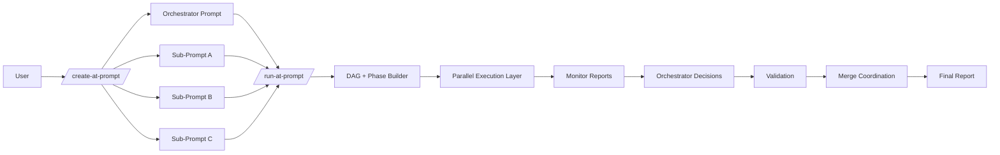

# Daplug Agent Teams Orchestration (Meta-Orchestration for Multi-CLI Prompt Execution)
> Status: Design specification for a new daplug plugin capability (implementation pending).
> Scope: Defines `/create-at-prompt` and `/run-at-prompt` as an orchestration layer for multi-CLI prompt execution.
> Audience: Plugin/skill maintainers, Claude Code power users, and teams coordinating Codex/Gemini/OpenCode/Claude CLI workflows.
> Related references:
> - `llms_txt/tools/ai-cli/claude-code/claude-code-agent-teams.llms-full.txt`
> - `llms_txt/tools/ai-cli/claude-code/claude-code-agent-orchestration.llms-full.txt`
> - `llms_txt/tools/ai-cli/claude-code/claude-code-task-tool-advanced.llms-full.txt`
> - `llms_txt/tools/ai-cli/opencode/opencode-task-orchestration-advanced.llms-full.txt`
## Table of Contents
1. Overview & Motivation
2. Architecture
3. `/create-at-prompt` Skill
4. `/run-at-prompt` Skill
5. Group Syntax Reference
6. Comparison Table
7. Integration with Existing daplug Infrastructure
8. Agent Team Roles & Model Tiering
9. Examples
10. Design Decisions & Trade-offs
---
## 1) Overview & Motivation
### 1.1 Why this feature exists
The daplug ecosystem already has strong execution primitives:
- `/create-prompt` for single prompt generation.
- `/run-prompt` for single prompt execution on multiple CLIs/models.
- `/sprint` for sequential multi-prompt execution.
- Worktree isolation for safe parallel development.
- tmux sessions for long-running background jobs.
- verification loops for quality gating.
The missing layer is **meta-orchestration**:
- There is no first-class way to design prompt packs that self-coordinate across multiple agents.
- There is no first-class way to run existing prompt sets with dependency reasoning and phase-aware parallel execution.
- There is no structured handoff model between monitoring, orchestration, validation, and merge coordination roles.
`/create-at-prompt` and `/run-at-prompt` close that gap.
### 1.2 Problem framing
Single-prompt systems work well for isolated tasks.
Real engineering work often spans:
- backend + frontend + tests + docs,
- shared files modified by parallel streams,
- different model strengths across workstreams,
- staged dependencies that require ordered execution.
Without orchestration, users manually manage order, conflicts, and verification.
Manual orchestration becomes brittle at scale.
### 1.3 Core proposition
- `/create-at-prompt`: transform one high-level objective into an orchestrator prompt + sub-prompts with explicit handoffs.
- `/run-at-prompt`: execute prompt sets as a DAG/phase workflow with explicit or inferred dependencies.
### 1.4 Guiding design principles
1. Explicit control first.
2. Auto inference as opt-in.
3. Reuse existing daplug primitives.
4. Isolate parallel work in worktrees.
5. Require evidence-based handoffs.
6. Prefer role-specific models for cost/performance.
7. Keep orchestration explainable and auditable.
### 1.5 Intended outcomes
When implemented well, users should be able to:
- create orchestration-ready prompt packs in one command,
- execute mixed sequential/parallel workflows with one compact syntax,
- route sub-prompts to different CLIs/models safely,
- surface failures with structured triage reports,
- validate and merge with less manual coordination overhead.
### 1.6 Relationship to existing commands
- `/create-prompt` remains best for quick single-agent prompt authoring.
- `/run-prompt` remains the atomic execution unit.
- `/sprint` remains useful for simple linear runs.
- `/create-at-prompt` and `/run-at-prompt` add orchestrator semantics, not replacement semantics.
### 1.7 Layered mental model
- Layer 0: Prompt text.
- Layer 1: Prompt execution (`/run-prompt`).
- Layer 2: Ordered prompt list (`/sprint`).
- Layer 3: Dependency-aware orchestration (`/run-at-prompt`).
### 1.8 When to use this feature
Use this orchestration layer when:
- there are multiple dependent workstreams,
- parallelism can reduce total runtime,
- merge/conflict risk must be managed systematically,
- multi-CLI/model routing improves throughput or quality.
Avoid it when:
- only one prompt is needed,
- dependencies are trivial,
- orchestration overhead would exceed task complexity.
### 1.9 Scope and non-scope
In scope:
- command syntax/specification,
- architecture and role model,
- execution graph semantics,
- validation and handoff contracts.
Out of scope:
- provider-specific runtime details beyond CLI routing abstractions,
- replacing existing `run-prompt` internals,
- UI dashboard implementation details.
---
## 2) Architecture
### 2.1 Architectural thesis
Use Claude agent teams as the **decision layer**.
Use coding CLIs as the **execution layer**.
Short form:
- Claude team = brain.
- Multi-CLI workers = hands.
### 2.2 High-level flow
Intent -> decomposition -> delegation -> execution -> validation -> merge -> final report.
### 2.3 Core components
1. Intent Parser
- Parses command arguments and flags.
- Resolves prompt IDs/names.
- Produces normalized run spec.
2. Planner
- For `/create-at-prompt`: decomposes objective into orchestrator + sub-prompts.
- For `/run-at-prompt --auto-deps`: infers dependencies and builds DAG.
3. Dispatcher
- Maps each prompt node to worktree, tmux session, CLI, and model.
- Launches node execution (typically through `/run-prompt`).
4. Monitor Mesh
- Lightweight monitor agents observe job state/logs.
- Emits structured Execution Reports.
5. Orchestrator
- Reads reports.
- Decides proceed/retry/escalate/merge-hand-off.
- Enforces phase barriers.
6. Validator
- Reviews combined outputs and acceptance criteria.
- Produces PASS/FAIL evidence.
7. Merger
- Coordinates worktree integration.
- Resolves or escalates file conflicts.
8. Reporter
- Publishes run artifacts and summary.
### 2.4 System diagram (text)
```text
User
  |
  | /create-at-prompt "goal"
  v
Claude planning team
  |
  +--> orchestrator prompt
  +--> sub-prompt 1
  +--> sub-prompt 2
  +--> sub-prompt N
  |
  | /run-at-prompt <groups|ids> [flags]
  v
DAG builder + dispatcher
  |
  +--> parallel CLI jobs (worktrees + tmux)
  |
  +--> monitor reports
  v
orchestrator decisions
  |
  +--> validator phase (optional)
  +--> merger coordination
  v
final summary + artifacts
```
### 2.5 System diagram (mermaid)

### 2.6 Brain vs hands split
Brain (Claude native roles):
- Planner (decompose + auto-deps)
- Orchestrator (phase decisions)
- Validator (cross-stream correctness)
- Merger coordinator (conflict management)
- Fixer escalation role (complex failures)
Hands (execution workers):
- Claude CLI, Codex CLI, Gemini CLI, OpenCode CLI, and additional supported CLIs.
### 2.7 Execution phases and barriers
A phase is a set of nodes that can run concurrently.
A barrier is a boundary that requires all nodes in the current phase to reach terminal state before continuing.
Terminal states:
- SUCCESS
- FAIL
- TIMEOUT
- ABORTED
### 2.8 Artifact model
Per run, recommended artifacts:
- `execution-plan.json` (nodes, edges, phases)
- `dispatch-map.json` (routing decisions)
- `node-status.json` (live and final statuses)
- `reports/<id>-execution-report.md`
- `validation-report.md` (if enabled)
- `merge-report.md`
- `final-summary.md`
### 2.9 Compatibility requirements
- Existing prompts remain runnable.
- Existing `/run-prompt` behavior remains intact.
- Optional prompt metadata can improve auto-deps and routing, but metadata is not mandatory.
### 2.10 Safety boundary
This design keeps one orchestrator tier.
Sub-workers do not recursively orchestrate sub-workers.
Rationale:
- lower complexity,
- clearer accountability,
- easier postmortem/auditing.
---
## 3) `/create-at-prompt` Skill
### 3.1 Purpose
Generate orchestration-ready prompt packs from a high-level description.
Output set:
- 1 main orchestrator prompt.
- N sub-prompts with role-specific scope.
- optional machine-readable dependency draft.
- suggested `/run-at-prompt` invocation patterns.
### 3.2 Input contract
Required input:
- high-level objective.
Optional inputs:
- preferred CLIs/models,
- cost or speed bias,
- quality gates,
- max sub-prompt count,
- output directory.
### 3.3 Proposed command syntax
```text
/create-at-prompt "<objective>" [options]
```
Proposed options:
- `--out-dir <path>`
- `--max-subprompts <n>`
- `--team-profile <default|strict|speed|cost>`
- `--model <model>`
- `--emit-dag`
- `--dry-run`
### 3.4 Output contract
Expected file outputs (example):
```text
prompts/at/220-orchestrator-feature-x.md
prompts/at/221-backend-workstream.md
prompts/at/222-frontend-workstream.md
prompts/at/223-tests-workstream.md
prompts/at/224-docs-workstream.md
```
### 3.5 Three-phase generation pipeline
Phase 1: Plan (Claude native)
- Analyze objective.
- Identify workstreams.
- Define constraints and acceptance criteria.
- Draft dependencies.
Phase 2: Fan-out prompt generation (delegated)
- Produce specialized sub-prompts.
- Include clear objectives/non-goals.
- Add output and validation contracts.
- Add model/CLI routing hints.
Phase 3: Validate and merge prompt pack (Claude native)
- Check coverage and overlap.
- Resolve ambiguity and missing dependencies.
- Ensure prompts are executable and testable.
### 3.6 Orchestrator prompt template
```markdown
# Orchestrator Prompt
## Objective
<goal>
## Inputs
- prompt IDs:
- repo context:
- constraints:
## Phase plan
1. phase A
2. phase B
3. validation and merge
## Decision policy
- proceed if all phase nodes PASS
- escalate on non-zero exit or conflict
## Validation gates
- tests
- lint/typecheck
- integration consistency
## Final deliverable
- summary + artifacts + unresolved risks
```
### 3.7 Sub-prompt template
```markdown
# Prompt <ID> - <name>
## Role
<role>
## Objective
<what to deliver>
## Must do
- item
- item
## Must not do
- item
## Dependencies
- depends on:
## Output contract
- expected files/artifacts
- expected checks
## Suggested routing
- CLI:
- Model:
## Done criteria
- measurable pass conditions
```
### 3.8 Differences from `/create-prompt`
`/create-prompt`:
- one prompt,
- minimal dependency semantics,
- quick single-agent workflow.
`/create-at-prompt`:
- orchestrator + sub-prompts,
- explicit orchestration contracts,
- built-in phase/dependency framing,
- designed for multi-CLI execution.
### 3.9 Quality rubric for generated prompts
Each generated prompt should be scored for:
- clarity (specific objective + boundaries),
- executability (no hidden context assumptions),
- verifiability (concrete done criteria),
- isolation (minimal overlap with peers),
- dependency soundness.
### 3.10 Example input/output
Input:
```text
/create-at-prompt "Implement feature flags with admin UI, backend API, tests, and docs"
```
Possible output summary:
```text
Created prompts/at/230-235
- 230 orchestrator
- 231 backend API
- 232 admin UI
- 233 tests
- 234 docs
- 235 cross-workstream validator
Suggested run:
/run-at-prompt 231,232 -> 233 -> 234,235 --validate
```
### 3.11 Suggested metadata frontmatter (optional)
```yaml
---
id: 231
role: backend-builder
depends_on: [230]
cli_hint: codex
model_hint: codex-xhigh
expected_paths:
  - src/api/
conflict_risk_paths:
  - src/shared/contracts.ts
checks:
  - npm run test -- api
  - npm run lint
---
```
### 3.12 Failure modes and mitigations
Failure: over-decomposition.
Mitigation: cap sub-prompt count and require stream consolidation.
Failure: under-decomposition.
Mitigation: require at least one explicit parallel opportunity when objective spans domains.
Failure: overlapping sibling scopes.
Mitigation: static overlap scan on expected/conflict paths.
Failure: missing validation coverage.
Mitigation: force generation of at least one validation/check prompt or explicit final validation plan.
### 3.13 Non-goals
`/create-at-prompt` should not:
- execute prompts,
- create worktrees,
- launch tmux sessions,
- merge branches.
Execution belongs to `/run-at-prompt`.
---
## 4) `/run-at-prompt` Skill
### 4.1 Purpose
Execute existing prompts using agent-team orchestration semantics:
- explicit grouped phases,
- auto dependency inference,
- hybrid explicit + inferred workflows,
- optional final validation.
### 4.2 Core modes
Mode 1: Explicit groups
- deterministic user-defined barriers.
Mode 2: Auto-deps
- planner reads prompt contents and builds DAG.
Mode 3: Hybrid
- user pins critical phase boundaries,
- planner resolves dependencies inside selected segments.
### 4.3 Command syntax (proposed)
```text
/run-at-prompt <spec-or-list> [--validate] [--model <model>] [--auto-deps]
```
Primary flags:
- `--validate`
- `--model <model>`
- `--auto-deps`
Recommended additional flags:
- `--loop <n>`
- `--max-parallel <n>`
- `--timeout <duration>`
- `--keep-worktrees`
- `--dry-run`
### 4.4 Required execution flow
1. Parse group syntax OR prompt list.
2. Build execution DAG.
3. For each phase:
- allocate worktrees,
- create tmux sessions,
- dispatch parallel nodes.
4. Wait for all phase nodes to complete.
5. Optional validator pass.
6. Continue to next phase or finish.
### 4.5 Explicit mode behavior
Example:
```text
/run-at-prompt 220,221 -> 222,223 -> 224 --validate
```
Semantics:
- phase 1: 220 and 221 parallel,
- phase 2: 222 and 223 parallel after phase 1 barrier,
- phase 3: 224 after phase 2 barrier,
- final validation phase enabled.
### 4.6 Auto-deps behavior
Example:
```text
/run-at-prompt 220 221 222 --auto-deps
```
Planner should analyze:
- explicit metadata (`depends_on`),
- language cues ("after", "requires", "depends on"),
- output/input contract links,
- known path overlap risk.
Result:
- inferred DAG + rationale report.
### 4.7 Hybrid behavior
Example:
```text
/run-at-prompt 220 -> 221,222 --auto-deps -> 224
```
Interpretation:
- 220 fixed as first phase.
- middle segment (`221,222`) auto-resolved internally.
- 224 fixed after middle segment completion.
If no dependency inferred between 221 and 222: run in parallel.
If `221 -> 222` inferred: split into internal mini phases.
### 4.8 Parser normalization
Normalize before planning:
- dedupe repeated IDs in a phase,
- reject empty phases,
- resolve names to IDs,
- separate local and global flags,
- produce intermediate representation (IR).
IR example:
```json
{
  "segments": [
    {"kind": "explicit", "nodes": [220]},
    {"kind": "auto", "nodes": [221, 222]},
    {"kind": "explicit", "nodes": [224]}
  ],
  "flags": {"validate": false, "default_model": null}
}
```
### 4.9 DAG construction rules
Rule A: nodes in same explicit phase are parallel.
Rule B: `->` adds barrier edges from every node in left phase to every node in right phase.
Rule C: auto segments may refine internal ordering.
Rule D: no cycles allowed.
Rule E: explicit barriers cannot be violated by auto inference.
### 4.10 Dispatch mechanics
For each node:
- resolve routing (CLI/model/worktree/tmux),
- execute through existing `/run-prompt` executor path,
- attach monitor agent,
- stream logs to `~/.claude/cli-logs/`.
### 4.11 Wait and decision loop
At phase boundary:
- gather monitor reports,
- derive phase decision:
  - PROCEED,
  - RETRY,
  - MERGE_HANDOFF,
  - ESCALATE.
Decision examples:
- all PASS -> proceed,
- deterministic test failures -> fixer path,
- overlapping file conflict -> merger path,
- stuck timeout -> restart once then escalate.
### 4.12 Validation step
`--validate` appends a validator gate after execution phases.
Validator checks:
- acceptance criteria,
- cross-workstream consistency,
- test/lint/typecheck evidence,
- unresolved conflict status.
Validator output contract:
```json
{
  "status": "PASS|FAIL",
  "blocking_findings": [],
  "non_blocking_findings": [],
  "evidence": []
}
```
### 4.13 Merge coordination
After successful phases (and optional validation), orchestrator coordinates merges:
- compute overlap matrix,
- choose merge order,
- resolve simple conflicts,
- escalate complex merges.
### 4.14 Outputs and artifacts
Required outputs:
- final run status,
- per-node reports,
- optional validation report,
- merge report,
- final summary.
Recommended artifact tree:
```text
.at-runs/<run-id>/
  execution-plan.json
  dispatch-map.json
  node-status.json
  reports/
  validation-report.md
  merge-report.md
  final-summary.md
```
### 4.15 Error handling and retries
Suggested default policy:
- retry once for transient provider/transport failures,
- do not auto-retry deterministic compile/test failures,
- escalate after bounded retries.
### 4.16 Safety constraints
Recommended default safety limits:
- `max_parallel=3`
- `node_retry_budget=1`
- `phase_timeout=45m`
- `run_timeout=3h`
### 4.17 Dry run mode
`--dry-run` should:
- parse and validate syntax,
- build phase plan,
- print routing and expected artifacts,
- perform no CLI execution.
### 4.18 Example dry-run output
```text
[AT] Parsed: 220 -> 221,222 --auto-deps -> 224
[AT] Internal plan:
  phase1: [220]
  phase2a: [221]
  phase2b: [222]
  phase3: [224]
[AT] validate: false
[AT] execution: skipped (dry-run)
```
---
## 5) Group Syntax Reference
### 5.1 Operators
- `,` parallel separator within phase.
- `->` sequential phase barrier.
- `--auto-deps` dependency inference toggle.
- `--validate` final validation phase toggle.
### 5.2 Required examples and semantics
Example 1:
```text
220,221 -> 222
```
- 220 and 221 parallel.
- 222 starts after both complete.
Example 2:
```text
220 -> 221,222,223 -> 224
```
- 220 first.
- 221/222/223 parallel second phase.
- 224 final phase.
Example 3:
```text
220,221 -> 222,223 -> 224 --validate
```
- explicit three-phase run.
- add validator gate at end.
Example 4:
```text
220 221 222 --auto-deps
```
- planner infers DAG from prompt content/metadata.
Example 5:
```text
220 -> 221,222 --auto-deps -> 224
```
- explicit edges around auto middle segment.
### 5.3 EBNF grammar (proposed)
```ebnf
command      := '/run-at-prompt' ws spec flags?
spec         := phased_spec | list_spec
phased_spec  := phase (ws? '->' ws? phase)*
phase        := node (ws? ',' ws? node)* (ws local_auto)?
list_spec    := node (ws node)+
node         := prompt_id | prompt_name
local_auto   := '--auto-deps'
flags        := (ws flag)*
flag         := '--validate' | '--auto-deps' | '--model' ws model
model        := token
```
### 5.4 Local vs global `--auto-deps`
Global mode:
```text
/run-at-prompt 220 221 222 --auto-deps
```
- applies inference to whole set.
Local mode:
```text
/run-at-prompt 220 -> 221,222 --auto-deps -> 224
```
- applies inference to nearest left phase segment.
### 5.5 Parsing ambiguity policy
Ambiguous forms must be resolved predictably with explicit diagnostics.
Diagnostic example:
```text
Ambiguous auto-deps scope near token '--auto-deps'.
Interpreted as local to phase '221,222'.
Use explicit form to avoid ambiguity: '220 -> (221,222 --auto-deps) -> 224' (future syntax).
```
### 5.6 Invalid input examples
Invalid:
```text
220,,221 -> 222
```
Reason: empty node between commas.
Invalid:
```text
220 -> -> 222
```
Reason: empty phase between barriers.
Invalid:
```text
-> 220,221
```
Reason: missing initial phase.
Invalid:
```text
220,221,
```
Reason: trailing comma.
### 5.7 Error message requirements
Error messages should include:
- offending token,
- byte/character position,
- one corrected example.
### 5.8 Syntax quick reference
```text
/run-at-prompt <spec> [--validate] [--model <model>] [--auto-deps]
spec examples:
  220,221 -> 222
  220 -> 221,222,223 -> 224
  220 221 222 --auto-deps
  220 -> 221,222 --auto-deps -> 224
```
---
## 6) Comparison Table
### 6.1 Command-level comparison
| Command | Purpose | Input | Output | Dependency Handling | Parallelism | Best For |
|---|---|---|---|---|---|---|
| `/create-prompt` | single prompt generation | one objective | one prompt | minimal | n/a | small isolated tasks |
| `/create-at-prompt` | orchestration prompt pack generation | high-level multi-stream objective | orchestrator + sub-prompts | designed explicitly | planned | complex multi-stream design |
| `/run-prompt` | single prompt execution | one prompt | one execution result | none/implicit | one unit | direct execution |
| `/run-at-prompt` | orchestrated multi-prompt execution | group spec or list | DAG run result + reports | explicit/auto/hybrid | native by phase | coordinated multi-CLI workflows |
| `/sprint` | ordered prompt batch execution | list in order | sequential batch result | sequential only | limited | linear workflows |
### 6.2 Practical selection guidance
Choose `/create-prompt` if you need one runnable prompt quickly.
Choose `/create-at-prompt` if you need explicit decomposition and orchestration readiness.
Choose `/run-prompt` for one-off execution.
Choose `/run-at-prompt` for dependency-aware, multi-CLI runs.
Choose `/sprint` when strict linear order is enough.
### 6.3 Summary mapping
- `/create-at-prompt` extends planning depth.
- `/run-at-prompt` extends execution control depth.
- `/sprint` remains a convenience path for simple linear jobs.
---
## 7) Integration with Existing daplug Infrastructure
### 7.1 Worktrees
Policy: each parallel node gets its own worktree.
Recommended path pattern:
```text
<worktree_root>/at-<prompt-id>-<slug>
```
Examples:
- `/storage/projects/docker/worktrees/at-220-backend`
- `/storage/projects/docker/worktrees/at-221-ui`
- `/storage/projects/docker/worktrees/at-222-tests`
Lifecycle:
1. create worktree,
2. execute node,
3. collect diff/report,
4. merge or retain,
5. cleanup/prune per policy.
### 7.2 tmux integration
Policy: each node gets its own tmux session.
Session pattern:
```text
at-<prompt-id>-<role>
```
Examples:
- `at-220-backend`
- `at-221-ui`
- `at-222-tests`
### 7.3 Verification loops
`--loop` semantics should work per node.
A node-level loop may rerun execution/checks until pass or retry budget exhaustion.
Phase progression remains barrier-based.
### 7.4 Model routing integration
Routing precedence:
1. explicit per-node override,
2. prompt metadata hint,
3. command-level `--model`,
4. orchestration default.
### 7.5 Logging
All execution logs should remain in:
```text
~/.claude/cli-logs/
```
Recommended filename:
```text
<cli>-<model>-<prompt-id>-<timestamp>.log
```
### 7.6 Reuse `/run-prompt` as execution primitive
`/run-at-prompt` should invoke `/run-prompt` internally for each node.
This avoids duplicated runtime logic and keeps provider behavior consistent.
### 7.7 Run artifact directory
```text
.at-runs/<run-id>/
  execution-plan.json
  dispatch-map.json
  node-status.json
  reports/
    <id>-execution-report.md
  validation-report.md
  merge-report.md
  final-summary.md
```
### 7.8 Conflict detection hooks
After each phase:
- detect overlapping modified paths,
- run merge dry-run checks,
- escalate to merger agent when risk is high.
### 7.9 Operational status output
Suggested live status line:
```text
[AT RUN <id>] Phase 2/4 | PASS:220,221 | FAIL:222 | waiting on retry
```
---
## 8) Agent Team Roles & Model Tiering
### 8.1 Model tiering strategy (required)
Use the cheapest capable model per role.
| Role | Model | Rationale |
|---|---|---|
| Monitor agents | **haiku** | Mechanical launch/watch/report tasks; minimal reasoning required. |
| Orchestrator | **sonnet** | Reads reports, coordinates phases, makes routing decisions. |
| Planner (auto-deps) | **sonnet** | Reads prompts, infers dependencies, builds explainable DAG. |
| Validator | **sonnet** | Cross-stream correctness and conflict review. |
| Fixer/Escalation | **opus** | Complex failure diagnosis and hard conflict resolution. |
| Merger | **sonnet** | Merge sequencing and straightforward conflict handling. |
### 8.2 Monitor agent pattern: triage nurse
Monitor agents should not diagnose deeply.
Monitor agents should triage with precise evidence and hand off.
Monitor tasks:
1. launch `/run-prompt` in tmux,
2. monitor log/session state,
3. produce structured Execution Report,
4. include triage flags with log references.
### 8.3 Execution Report template (required)
```markdown
## Prompt 220 Execution Report
- **Status**: FAIL (exit code 1)
- **Model**: codex-xhigh
- **Duration**: 4m 32s
- **Worktree**: /storage/projects/docker/worktrees/at-220-backend
- **Log**: ~/.claude/cli-logs/codex-xhigh-220-20260212-143200.log
- **tmux session**: at-220-backend (still alive)
### Last 20 lines of output:
[pasted log tail]
### Triage Flags:
- ESCALATE: Test failures detected (3 failing, see log lines 847-892)
- ESCALATE: Merge conflict in src/api/routes.ts (parallel prompt 221 may have touched same file)
- OK: Build succeeded
- OK: Lint clean
```
### 8.4 Triage flag rules (required)
Escalate when:
- exit code != 0,
- `FAIL` / `error` / `conflict` appears in log tail,
- duration exceeds threshold (for example 2x expected),
- worktree has uncommitted changes after abnormal exit,
- multiple prompts in same phase touched overlapping files.
OK when:
- clean exit,
- required checks pass,
- no unresolved overlap conflicts.
### 8.5 Orchestrator decision flow (required)
- all OK -> merge and proceed,
- test failures -> inspect referenced lines and dispatch fixer,
- file conflicts -> handoff to merger agent with worktree paths,
- stuck process -> kill session, retry once, then escalate.
### 8.6 Role catalog
Planner agent (sonnet):
- decomposition and DAG inference.
Monitor agents (haiku):
- command launch + status observation + triage reporting.
Validator agent (sonnet):
- acceptance and consistency review.
Merger agent (sonnet):
- merge sequencing and conflict coordination.
Fixer agent (opus on-demand):
- complex error recovery.
### 8.7 Role boundary rules
Monitor:
- no architecture diagnosis,
- no broad refactor proposals,
- evidence-only triage.
Orchestrator:
- consumes monitor reports first,
- escalates only with concrete pointers.
Validator:
- no large new implementation work,
- produce clear fix-list if FAIL.
### 8.8 Role templates (concise)
Monitor template:
```markdown
You are monitor for prompt <ID>.
Launch command, watch session/log, return Execution Report template.
Include line references for all ESCALATE flags.
Do not diagnose root cause beyond triage.
```
Orchestrator template:
```markdown
You are orchestration lead.
Input: phase plan + monitor reports.
Output: decision (PROCEED/RETRY/ESCALATE/MERGE_HANDOFF) and exact next actions.
```
Validator template:
```markdown
You are cross-workstream validator.
Return PASS/FAIL with blocking findings and evidence.
If FAIL, return ordered minimal fix list.
```
### 8.9 Why this tiering is cost-effective
- Most cycles are monitoring and routing; haiku handles these cheaply.
- Sonnet handles planning/coordination with reliable cost-quality tradeoff.
- Opus is reserved for rare hard failures.
---
## 9) Examples
### Example 1: Simple explicit two-prompt parallel run (required)
Scenario:
- 220 backend update,
- 221 frontend update,
- 222 integration checks.
Command:
```text
/run-at-prompt 220,221 -> 222 --validate
```
Expected execution plan:
```json
{
  "phases": [[220, 221], [222]],
  "validate": true
}
```
Illustrative routing:
```json
{
  "220": {"cli": "codex", "model": "codex-xhigh", "worktree": ".../at-220-backend", "tmux": "at-220-backend"},
  "221": {"cli": "gemini", "model": "gemini25pro", "worktree": ".../at-221-frontend", "tmux": "at-221-frontend"},
  "222": {"cli": "claude", "model": "sonnet", "worktree": ".../at-222-integration", "tmux": "at-222-integration"}
}
```
Illustrative monitor output:
```markdown
## Prompt 221 Execution Report
- Status: PASS
- Duration: 3m 11s
- Log: ~/.claude/cli-logs/gemini-gemini25pro-221-20260212-150012.log
- Triage Flags:
  - OK: Build succeeded
  - OK: Lint clean
  - ESCALATE: Shared file overlap with 220 at src/shared/apiClient.ts (lines 344-368)
```
Orchestrator response:
- hold barrier,
- run merger handoff for shared file,
- continue to 222 when resolved.
### Example 2: Complex five-prompt mixed flow (required)
Scenario:
- 230 schema migration,
- 231 backend logic,
- 232 UI wiring,
- 233 integration tests,
- 234 docs.
Command:
```text
/run-at-prompt 230 -> 231,232 -> 233 -> 234 --validate
```
Interpretation:
- migration first,
- backend/ui parallel second phase,
- tests third,
- docs fourth,
- validation at end.
Illustrative timeline:
```text
Phase1: 230 PASS (4m10s)
Phase2: 231 PASS (5m20s), 232 PASS (5m01s)
Phase3: 233 FAIL (2 tests)
Retry path: 233 with fixer support -> PASS (3m34s)
Phase4: 234 PASS (2m48s)
Validation: PASS
Total: 22m53s
```
### Example 3: Auto-deps with four prompts (required)
Command:
```text
/run-at-prompt 240 241 242 243 --auto-deps
```
Possible inference result:
```json
{
  "edges": [
    [240, 241],
    [240, 242],
    [241, 243],
    [242, 243]
  ],
  "rationale": {
    "240->241": "241 uses schema introduced in 240",
    "240->242": "242 consumes API contract created in 240",
    "241->243": "243 integration checks backend behavior from 241",
    "242->243": "243 requires UI updates from 242"
  },
  "phases": [[240], [241, 242], [243]]
}
```
### Example 4: Full create-to-run lifecycle (required)
Step 1:
```text
/create-at-prompt "Implement team-based RBAC with audit logs, admin UI, and docs"
```
Generated prompts (illustrative):
```text
260-orchestrator-rbac.md
261-rbac-schema.md
262-rbac-backend-enforcement.md
263-rbac-admin-ui.md
264-audit-log-pipeline.md
265-rbac-tests-and-docs.md
```
Step 2 (suggested execution):
```text
/run-at-prompt 261 -> 262,263,264 -> 265 --validate
```
Step 3 (artifact review):
- `.at-runs/<run-id>/execution-plan.json`
- `.at-runs/<run-id>/reports/`
- `.at-runs/<run-id>/validation-report.md`
- `.at-runs/<run-id>/merge-report.md`
- `.at-runs/<run-id>/final-summary.md`
### Example 5: Required syntax variants recap
```text
/run-at-prompt 220,221 -> 222
/run-at-prompt 220 -> 221,222,223 -> 224
/run-at-prompt 220,221 -> 222,223 -> 224 --validate
/run-at-prompt 220 221 222 --auto-deps
/run-at-prompt 220 -> 221,222 --auto-deps -> 224
```
### Example 6: Hybrid with local auto segment expansion
Command:
```text
/run-at-prompt 270 -> 271,272,273 --auto-deps -> 274
```
Planner infers:
- 271 and 272 parallel,
- 273 depends on both.
Internal plan becomes:
```text
270 -> 271,272 -> 273 -> 274
```
### Example 7: Per-node model overrides with global default
Command:
```text
/run-at-prompt 280,281 -> 282 --model sonnet --validate
```
Prompt metadata:
- 280 model hint = codex-xhigh,
- 281 model hint = gemini25pro,
- 282 no hint.
Result:
- 280 uses codex-xhigh,
- 281 uses gemini25pro,
- 282 uses global sonnet.
### Example 8: Stuck process handling
Condition:
- node 290 runs >2x expected duration,
- no log growth,
- tmux session still alive.
Recovery sequence:
1. mark node STUCK,
2. capture tail,
3. kill tmux session,
4. retry once,
5. escalate on second failure.
Illustrative commands:
```bash
tmux kill-session -t at-290-backend
/run-prompt 290 --model sonnet --retry 1
```
### Example 9: Conflict-heavy parallel phase
Command:
```text
/run-at-prompt 300,301,302 -> 303 --validate
```
Detected overlaps:
- 300 and 301 edit `src/auth/policy.ts`,
- 301 and 302 edit `src/shared/types.ts`.
Decision:
- pause at phase barrier,
- dispatch merger agent,
- continue only after conflict status is clean or explicitly waived.
### Example 10: Minimal dry-run planning session
Command:
```text
/run-at-prompt 320 -> 321,322 --auto-deps -> 323 --dry-run
```
Output:
```text
[AT] Parsed segments: explicit[320], auto[321,322], explicit[323]
[AT] Expanded plan: [320] -> [321] -> [322] -> [323]
[AT] Validation: disabled
[AT] Dispatch: skipped (dry-run)
```
---
## 10) Design Decisions & Trade-offs
### 10.1 Two skills instead of one
Decision:
- separate `/create-at-prompt` and `/run-at-prompt`.
Why:
- planning and execution are different responsibilities,
- easier testing and lifecycle management,
- allows prompt-pack generation and deferred execution.
Trade-off:
- two-step UX.
Mitigation:
- `/create-at-prompt` should emit suggested `/run-at-prompt` command.
### 10.2 `->` as phase separator
Decision:
- use `->` for sequential barriers.
Why:
- intuitive pipeline metaphor,
- compact and readable in shell contexts,
- simple parser model.
Trade-off:
- needs robust error messages for malformed expressions.
### 10.3 Auto-deps is opt-in
Decision:
- inference requires explicit `--auto-deps`.
Why:
- preserves deterministic behavior by default,
- avoids surprising schedule changes,
- supports production predictability.
Trade-off:
- users must choose inference when beneficial.
### 10.4 Level 1 vs Level 2 orchestration
Level 1 (decomposition only):
- generate prompt packs,
- user controls execution manually.
Level 2 (self-orchestrating execution):
- planner builds DAG,
- orchestrator handles retries/conflicts/validation flow.
Guidance:
- start with level 1 for uncertain workflows,
- use level 2 for mature recurring multi-stream workflows.
### 10.5 Model tiering by role
Decision:
- monitors use haiku,
- orchestrator/planner/validator/merger use sonnet,
- fixer uses opus on demand.
Why:
- cost-efficient baseline,
- capability matched to cognitive complexity,
- high-end reasoning reserved for difficult branches.
Trade-off:
- routing policy complexity.
Mitigation:
- encode defaults in profiles and keep manual override support.
### 10.6 Triage nurse pattern
Decision:
- monitor agents triage and hand off, not diagnose.
Why:
- faster reporting loops,
- cleaner responsibility boundaries,
- better evidence quality for orchestrator decisions.
Trade-off:
- extra handoff hop.
Mitigation:
- enforce structured report format and line-level evidence.
### 10.7 Log paths and line numbers in handoffs
Decision:
- include explicit log path + line references in escalation flags.
Why:
- orchestrator can act immediately,
- avoids context-search latency,
- improves reproducibility and auditability.
Trade-off:
- monitor reports are slightly longer.
### 10.8 Explicit control vs automation
Decision:
- explicit mode remains first-class,
- auto/hybrid modes add optional optimization.
Why:
- predictability matters in engineering workflows,
- automation should be explainable and reversible.
### 10.9 Reuse existing primitives
Decision:
- run nodes through existing `/run-prompt` path,
- retain worktree/tmux/logging/loop conventions.
Why:
- lower implementation risk,
- less behavior drift,
- faster adoption.
### 10.10 Throughput vs safety
Parallel fan-out increases speed but can raise conflict risk.
Design stance:
- use phase barriers,
- use monitor triage,
- run optional validation gate,
- escalate merges when overlap risk is high.
### 10.11 Default policy recommendations
- explicit groups by default,
- `--validate` on shared/production branches,
- `max_parallel=3` initial default,
- one retry for transient failures,
- escalate on repeated deterministic failures.
### 10.12 Implementation-ready checklist
- parser for grouped syntax + diagnostics,
- DAG builder with cycle detection,
- dispatcher using worktree + tmux + `/run-prompt`,
- monitor report generator with triage flags,
- orchestrator decision engine,
- optional validator phase,
- merger handoff path,
- persisted run artifacts.
### 10.13 Final positioning
This feature is intentionally pragmatic:
- predictable where needed,
- automated where safe,
- observable everywhere.
It extends daplug from prompt execution tooling into a practical multi-CLI orchestration framework.
